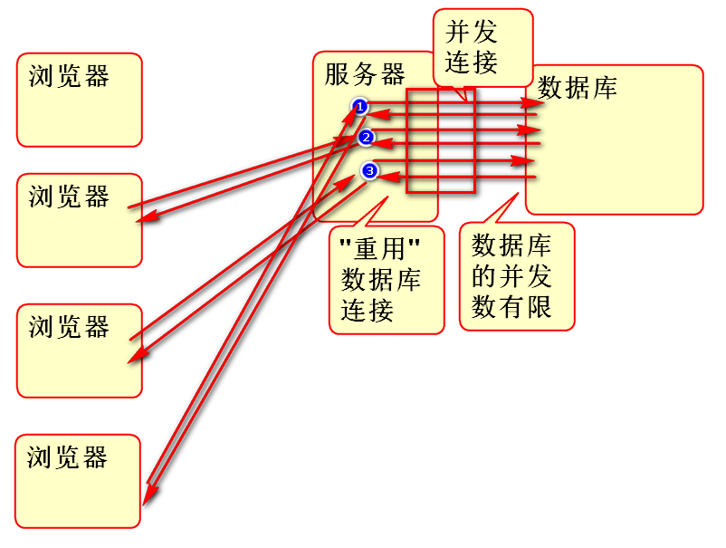
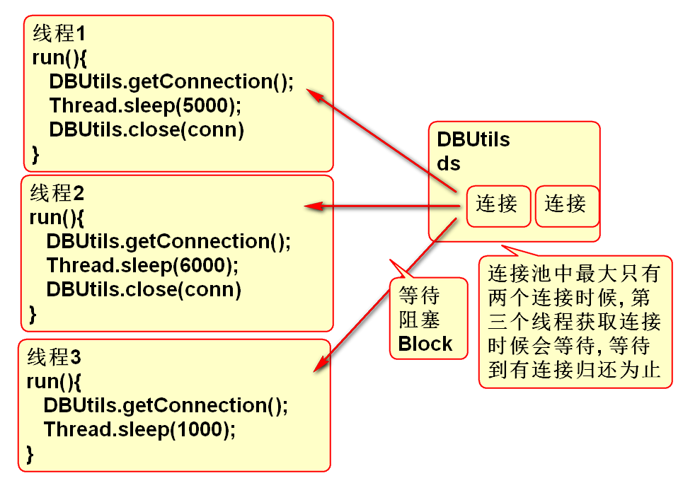
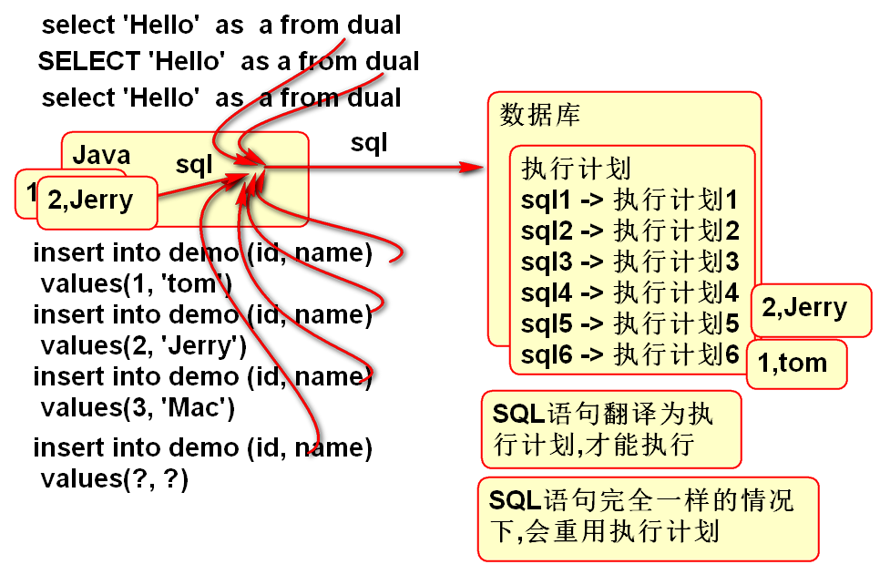
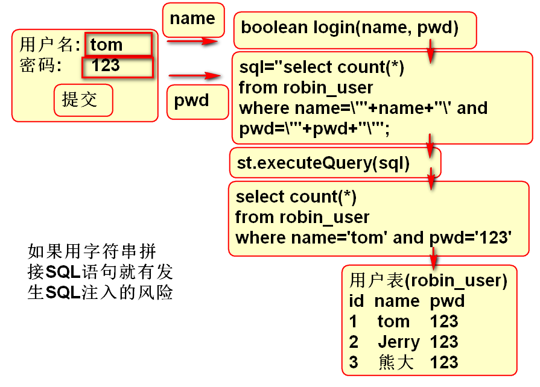

# JDBC

## 数据库连接池

数据库连接池是管理并发访问数据库连接的理想解决方案.

DriverManager管理数据库连接适合单线程情况, 而在多线程并发情况下,为了能够重用数据库连接, 同时控制并发连接总数,保护数据库避免连接过载, 一定要使用数据库连接池.

连接池原理:

### 使用DBCP连接池 

数据库连接池的开源实现非常多, DBCP是常用的连接池之一.

导入DBCP pom.xml:

	<dependency>
	  <groupId>commons-dbcp</groupId>
	  <artifactId>commons-dbcp</artifactId>
	  <version>1.4</version>
	</dependency>	

使用DBCP:

1. 导入连接池jar
2. 创建连接池对象
3. 设置数据库必须的连接参数
4. 设置可选的连接池管理策略参数
5. 从连接池中获得活动的数据库连接
6. 使用连接范围数据库
7. 使用以后关闭数据库连接
	- 这个关闭不是真的关闭连接,而是将使用过的连接归还给连接池.

案例:

		String driver="oracle.jdbc.OracleDriver";
		String url="jdbc:oracle:thin:@192.168.201.227:1521:orcl";
		String username = "openlab";
		String password = "open123";
		BasicDataSource ds = 
			new BasicDataSource();
		//设置必须的参数
		ds.setDriverClassName(driver);
		ds.setUrl(url);
		ds.setUsername(username);
		ds.setPassword(password);
		//设置连接池的管理策略参数
		ds.setInitialSize(2);
		ds.setMaxActive(100);
		//使用连接池中的数据库连接
		Connection conn=ds.getConnection();
		//执行SQL
		String sql = "select 'hello' as a "
				+ "from dual";
		Statement st=conn.createStatement();
		ResultSet rs=st.executeQuery(sql);
		while(rs.next()){
			String str = rs.getString("a");
			System.out.println(str);
		}
		//归还连接到数据库连接池!!
		conn.close();

为了便捷的使用连接池,经常将连接池封装为一个连接管理工具类:

	/**
	 * 连接池版本的 数据库 连接管理工具类
	 * 适合于并发场合 
	 */
	public class DBUtils {
		private static String driver;
		private static String url;
		private static String username;
		private static String password;
		private static int initSize;
		private static int maxActive;
		private static BasicDataSource ds;
		
		static{
			ds=new BasicDataSource();
			Properties cfg=new Properties();
			try{
				InputStream in = DBUtils.class
					.getClassLoader()
					.getResourceAsStream("db.properties");
				cfg.load(in);
				//初始化参数
				driver = cfg.getProperty("jdbc.driver");
				url = cfg.getProperty("jdbc.url");
				username = cfg.getProperty("jdbc.username");
				password = cfg.getProperty("jdbc.password");
				initSize = Integer.parseInt( 
						cfg.getProperty("initSize"));
				maxActive = Integer.parseInt(
						cfg.getProperty("maxActive")); 
				in.close();
				//初始化连接池
				ds.setDriverClassName(driver);
				ds.setUrl(url);
				ds.setUsername(username);
				ds.setPassword(password);
				ds.setInitialSize(initSize);
				ds.setMaxActive(maxActive); 
			}catch(Exception e){
				e.printStackTrace();
				throw new RuntimeException(e);
			}
		}
		
		public static Connection getConnection(){
			try{
				//getConnection()从连接池中获取重用
				//的连接, 如果连接池满了,则等待. 
				//如果有连接归还,则获取重用的连接
				Connection conn = ds.getConnection();
				return conn;
			}catch(Exception e){
				e.printStackTrace();
				throw new RuntimeException(e);
			}
		}
		
		public static void close(Connection conn){
			if(conn!=null){
				try {
					//将用过的连接归还到连接池
					conn.close();
				} catch (Exception e) {
					e.printStackTrace();
				}
			}
		}
	}

其配套参数配置文件 db.properties:
		
	# db.properties
	jdbc.driver=oracle.jdbc.OracleDriver
	jdbc.url=jdbc:oracle:thin:@192.168.201.227:1521:orcl
	jdbc.username=openlab
	jdbc.password=open123
	
	# paramter for BasicDataSource
	initSize=2
	maxActive=2

测试:

	public class Demo02 {
		public static void main(String[] args) {
			Connection conn = null;
			try{
				conn = DBUtils.getConnection();
				String sql="select 'Hello' as a "
						+ "from dual";
				Statement st = conn.createStatement();
				ResultSet rs = st.executeQuery(sql);
				while(rs.next()){
					String str=rs.getString("a");
					System.out.println(str);
				}
				rs.close();
				st.close();
			}catch(Exception e){
				e.printStackTrace();
			}finally{
				DBUtils.close(conn); 
			}
		}
	}

> DBUtils 简化了数据库访问

连接池并发性测试: 

测试原理:

测试案例:

	/*
	 * 连接池并发测试
	 */
	public class Demo03 {
		public static void main(String[] args) {
			Thread t1 = new DemoTherad(5000);
			Thread t2 = new DemoTherad(6000);
			Thread t3 = new DemoTherad(1000);
			t1.start();
			t2.start();
			t3.start();
		}
	}
	
	class DemoTherad extends Thread{
		int wait;
		
		public DemoTherad(int wait) {
			this.wait=wait;
		}
		
		public void run() {
			Connection conn = null;
			try {
				//getConnection方法在连接池中没有
				//连接可以使用时候,会阻塞等待
				conn=DBUtils.getConnection();
				System.out.println("获取了连接:"+conn);
				Thread.sleep(wait);
				String sql = "select 'Hello' as a "
						+ "from dual";
				Statement st=conn.createStatement();
				ResultSet rs=st.executeQuery(sql);
				while(rs.next()){
					System.out.println(rs.getString("a"));
				}
				System.out.println(wait+"结束"); 
			} catch (Exception e) {
				e.printStackTrace();
			}finally {
				DBUtils.close(conn);
			}
		}
	}

## PreparedStatement 

PreparedStatement 对象用于执行带参数的预编译执行计划, 其原理是:

关于执行计划:

1. 任何SQL执行过程都是先编译"执行计划",再执行"执行计划"
2. 数据库为了优化性能, 在SQL相同时候, 会重用执行计划
	- 执行计划编译较慢
	- 重用执行计划可以提高数据库性能
3. 数据库只在SQL语句完全一样时候才重用相同的执行计划
	- 如果SQL语句中有一个字符的更改,也会执行不同的执行计划
	- SQL中一个空格或者一个大小写不同也会创建不同的执行计划

> PreparedStatement 好处是可以重复使用执行计划,提高DB效率

使用步骤

1. 将带参数的SQL发送到数据库创建执行计划
2. 替换执行计划中的参数
3. 执行执行计划,得到结果

案例:

	/**
	 * 演示预编译的SQL执行计划 
	 */
	public class Demo04 {
		public static void main(String[] args) {
			Connection conn = null;
			try {
				conn = DBUtils.getConnection();
				//创建带参数的SQL语句.
				String sql="insert into robin_demo "
						+ "(id, name) values (?,?)";
				//将SQL发送到数据库,创建执行计划
				//返回值 ps 就代表执行计划
				PreparedStatement ps=
					conn.prepareStatement(sql);
				//替换执行计划中的参数, 2个参数
				//按照序号发送参数
				ps.setInt(1, 9);
				ps.setString(2, "Andy");
				//执行"执行计划"
				int n=ps.executeUpdate();
				System.out.println(n); 
				//再次重复使用执行计划
				ps.setInt(1, 100);
				ps.setString(2, "Wang"); 
				n = ps.executeUpdate();
				System.out.println(n); 
			} catch (Exception e) {
				e.printStackTrace();
			}finally{
				DBUtils.close(conn);
			}
		}
	}

案例:

	/**
	 * 使用执行计划执行更新语句 
	 */
	public class Demo05 {
		public static void main(String[] args) {
			Connection conn = null;
			try{
				conn = DBUtils.getConnection();
				String sql="update robin_demo "
						+ "set name=? "
						+ "where id=? ";
				PreparedStatement ps=
					conn.prepareStatement(sql);
				ps.setString(1, "Lao Wang");
				ps.setInt(2, 100);
				int n=ps.executeUpdate();
				System.out.println(n);//1
				//?
			}catch(Exception e){
				e.printStackTrace();
			}finally{
				DBUtils.close(conn);
			}
		}
	
	}

案例: 带参数的查询功能:

	/**
	 * 利用PS 实现查询功能 
	 */
	public class Demo06 {
		public static void main(String[] args) {
			Connection conn = null;
			try {
				conn = DBUtils.getConnection();
				String sql="select id, name "
						+ "from robin_demo "
						+ "where name like ? ";
				PreparedStatement ps =
					conn.prepareStatement(sql);
				ps.setString(1, "%w%"); 
				ResultSet rs=ps.executeQuery(); 
				while(rs.next()){
					//getInt(列的序号),利用序号获取值
					int id=rs.getInt(1);
					String name=rs.getString(2);
					System.out.println(id+","+name);
				}
			} catch (Exception e) {
				e.printStackTrace();
			} finally {
				DBUtils.close(conn); 
			}
		}
	}

### PreparedStatement 可以避免SQL注入攻击

何为注入攻击:

用户输入了 含有SQL成分的参数, 参数在拼接SQL时候造成SQL语句的语义改变! 进一步改变SQL语句的执行计划! 最终的执行结果就完全变了!!!

如何避免:

1. 拦截用户输入的SQL成分
2. 固定执行计划,避免改变执行逻辑	

原理:

一个注入攻击的例子:

数据准备:

	create table robin_user1(
	  id number(6),
	  name varchar2(100),
	  pwd varchar2(100)
	);
	insert into robin_user1 (id, name, pwd)
		values (1, 'tom', '123' );
	insert into robin_user1 (id, name, pwd)
		values (2, 'jerry', '123' );

案例代码:

	public class Demo07 {
		public static void main(String[] args) {
			//获取用户输入
			Scanner in = new Scanner(System.in);
			System.out.print("用户名:");
			String name=in.nextLine();
			System.out.print("密码:");
			String pwd = in.nextLine();
			//检查登录情况
			boolean pass=login(name, pwd);
			if(pass){
				System.out.println("欢迎你!"+name);
			}else{
				System.out.println("用户名或者密码错误!");
			}
		}
		
				
		//检查用户是否能够登录
		public static boolean login(
			String name, String pwd){
			String sql="select count(*) as c "
					+ "from robin_user1 "
					+ "where name=\'"+name+"\' "
					+ "and pwd=\'"+pwd+"\' ";
			System.out.println(sql); 
			Connection conn=null;
			try {
				conn = DBUtils.getConnection();
				Statement st=conn.createStatement();
				ResultSet rs=st.executeQuery(sql);
				while(rs.next()){
					int n = rs.getInt("c");
					return n>=1;
				}
			} catch (Exception e) {
				e.printStackTrace();
			}finally{
				DBUtils.close(conn);
			}
			return false;
		}
	}
	
测试:
	
	在输入用户名 tom 和密码: 1' or '1'='1 时候出现注入攻击现象

使用 PS 就可以避免注入攻击, 更新login方法如下:

	/**
	 * 利用 PS 就可以避免注入攻击
	 * @param name
	 * @param pwd
	 * @return
	 */
	public static boolean login(
		String name, String pwd){
		String sql = "select count(*) as c "
				+ "from robin_user1 "
				+ "where name=? and pwd=? ";
		Connection conn = null;
		try {
			conn = DBUtils.getConnection();
			PreparedStatement ps=
				conn.prepareStatement(sql);
			ps.setString(1, name);
			ps.setString(2, pwd); 
			ResultSet rs=ps.executeQuery();
			while(rs.next()){
				int n = rs.getInt("c");
				return n>=1;
			}
		} catch (Exception e) {
			e.printStackTrace();
		}finally{
			DBUtils.close(conn); 
		}
		return false;
	}

测试结果不会发生注入攻击

------------------------------------------------------
## 作业

实现课堂全部案例代码

1. 测试数据库连接池的使用
2. 测试数据库连接池的并发性
3. 封装连接管理工具类 DBUtils
4. 利用PS实现数据库插入功能
5. 利用PS实现数据库更新功能
6. 利用PS实现数据库删除功能
7. 利用PS实现数据库查询功能
8. 完成SQL注入案例

	