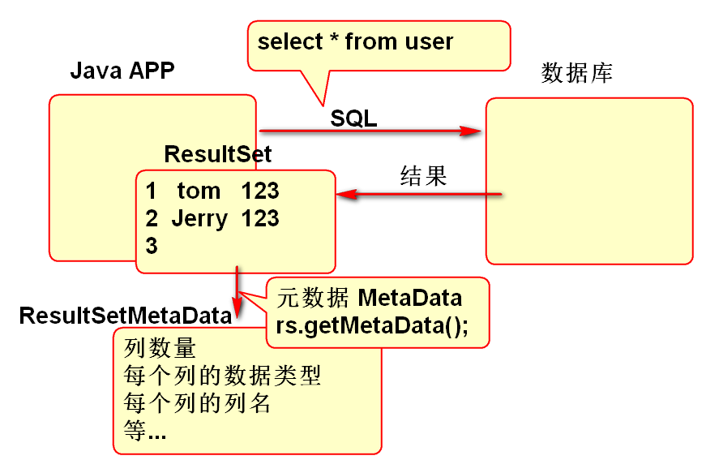

# JDBC

## 结果集元数据

ResultSetMetaData用于描述查询结果的相关信息, 其中包含列名称, 列数量, 类数据类型等.

原理:

使用案例:

	public static void main(String[] args) {
		Connection conn = null;
		try {
			conn = DBUtils.getConnection();
			String sql = "select * from "
					+ "robin_user";
			Statement st = conn.createStatement();
			ResultSet rs=st.executeQuery(sql);
			//结果集元数据
			ResultSetMetaData meta=
				rs.getMetaData();
			int n = meta.getColumnCount();
			for(int i=1; i<=n; i++){
			// i = 1 ... n
				String name= meta.getColumnName(i);
				System.out.println(name);
			}
		} catch (Exception e) {
			e.printStackTrace();
		} finally {
			DBUtils.close(conn);
		}
	}

作业:

	/**
	 * 打印一个SQL查询结果的全部列名
	 * @param sql
	 */
	public static void print(String sql){
		//...
	}

## JDBC 事务控制

数据库提供了事务控制功能, 支持ACID特性.

JDBC提供了API, 方便的调用数据库的事务功能, 其方法有:

相关API：

- Connection.getAutoCommit():获得当前事务的提交方式，默认为true
- Connection.setAutoCommit():设置事务的提交属性，参数是
	- true：自动提交；false：不自动提交
- Connection.commit():提交事务
- Connection.rollback():回滚事务

事务API调用模板:

	Connection conn = null;
	try {
		conn = DBUtils.getConnection();
		//取消自动提交, 后续手动提交
		conn.setAutoCommit(false);
		//SQL... update
		//SQL... update
		// 余额不足 抛出异常 throw e;
		//SQL... update
		conn.commit();
	} catch (Exception e) {
		e.printStackTrace();
		DBUtils.rollback(conn);
	} finally {
		DBUtils.close(conn);
	}

> 提示: 事务API经典的用法是采用如上模板, 其中DBUtils.rollback()方法封装了回滚方法, 其声明如下:

	public static void rollback(Connection conn) {
		if(conn!=null){
			try {
				conn.rollback();
			} catch (Exception e) {
				e.printStackTrace();
			}
		}
	}

事务测试案例数据:

	create table r_account(
		id number(6),
		name varchar2(100),
		balance number(8,2)
	);
	
	insert into r_account (id, name, balance) 
		values (1, '范老师', 500);
	
	insert into r_account (id, name, balance) 
		values (2, '刘老师', 1500);
	
	insert into r_account (id, name, balance) 
		values (3, '何仙姑', 2000);
	
	commit;

汇款案例:

	public static void main(String[] args) {
		pay(1, 4, 500); 
		System.out.println("ok"); 
	}
	
	public static void pay(
		int from , int to, double money){
		String sql1="update r_account "
				+ "set balance=balance+? "
				+ "where id=?";
		String sql2="select balance from "
				+ "r_account where id=?";
		Connection conn = null;
		try {
			conn = DBUtils.getConnection();
			conn.setAutoCommit(false); 
			PreparedStatement ps=
				conn.prepareStatement(sql1);
			//减钱
			ps.setDouble(1, -money); 
			ps.setInt(2, from);
			int n = ps.executeUpdate();
			if(n!=1){
				throw new Exception("扣错了");
			}
			//增加
			ps.setDouble(1, money);
			ps.setInt(2, to); 
			n = ps.executeUpdate();
			if(n!=1){
				throw new Exception("加错了");
			}
			ps.close();
			//检查
			ps = conn.prepareStatement(sql2);
			ps.setInt(1, from);
			ResultSet rs=ps.executeQuery();
			while(rs.next()){
				double bal=rs.getDouble(1);
				if(bal<0){
					throw new Exception("透支");
				}
			}			
			conn.commit();
		} catch (Exception e) {
			e.printStackTrace();
			DBUtils.rollback(conn);
		}finally{
			DBUtils.close(conn);
		}
		
	}

## 批量执行

批处理：发送到数据库作为一个单元执行的一组更新语句

批处理降低了应用程序和数据库之间的网络调用
相比单个SQL语句的处理，批处理更为有效

API方法:

- addBatch(String sql) 
	- Statement类的方法, 可以将多条sql语句添加Statement对象的SQL语句列表中
- addBatch()
	- PreparedStatement类的方法, 可以将多条预编译的sql语句添加到PreparedStatement对象的SQL语句列表中
- executeBatch()
	- 把Statement对象或PreparedStatement对象语句列表中的所有SQL语句发送给数据库进行处理
- clearBatch()
	- 清空当前SQL语句列表

案例: 批量执行DDL

	public static void main(String[] args) {
		String sql1="create table log_01 "
				+ "(id number(8), "
				+ "msg varchar2(100))";
		String sql2="create table log_02 "
				+ "(id number(8), "
				+ "msg varchar2(100))";
		String sql3="create table log_03 "
				+ "(id number(8), "
				+ "msg varchar2(100))";
		//执行一批SQL
		Connection conn = null;
		try {
			conn = DBUtils.getConnection();
			Statement st=conn.createStatement();
			//sql1 添加到Statement的缓存中 
			st.addBatch(sql1);
			st.addBatch(sql2);
			st.addBatch(sql3);
			//执行一批SQL
			int[] ary=st.executeBatch();
			System.out.println(Arrays.toString(ary)); 
			System.out.println("OK"); 
		} catch (Exception e) {
			e.printStackTrace();
		} finally {
			DBUtils.close(conn);
		}
		
	}

案例: 批量插入数据

	public static void main(String[] args) {
		String sql="insert into robin_user "
				+ "( id, name, pwd ) "
				+ "values (?,?,?)";
		Connection conn = null;
		try {
			conn = DBUtils.getConnection();
			PreparedStatement ps=
				conn.prepareStatement(sql);
			for(int i=0; i<100; i++){
				//替换参数
				ps.setInt(1, i);
				ps.setString(2,"name"+i);
				ps.setString(3, "123");
				//将参数添加到ps缓存区
				ps.addBatch();
			}
			//批量执行
			int[] ary=ps.executeBatch();
			System.out.println(Arrays.toString(ary));
		} catch (Exception e) {
			e.printStackTrace();
		} finally {
			DBUtils.close(conn);
		}
	}

防止批量过大出现OutOfMemory错误:

> 如果Preparedstatement对象中的缓存列表包含过多的待处理数据, 可能会产生OutOfMemory错误, 分段处理缓存列表.

案例:

	public static void main(String[] args) {
		String sql="insert into robin_user "
				+ "( id, name, pwd ) "
				+ "values (?,?,?)";
		Connection conn = null;
		try {
			conn = DBUtils.getConnection();
			PreparedStatement ps=
				conn.prepareStatement(sql);
			for(int i=0; i<100; i++){
				//替换参数
				ps.setInt(1, i);
				ps.setString(2,"name"+i);
				ps.setString(3, "123");
				//将参数添加到ps缓存区
				ps.addBatch();
				//i = 0 1 2 3 4 5 6 7 8 9 ..
				//    ...15...23...31
				if((i+1)%8==0){
					int[] ary=
						ps.executeBatch();
					ps.clearBatch();
					System.out.println(
						Arrays.toString(ary));
				}
			}
			//批量执行
			int[] ary=ps.executeBatch();
			System.out.println(Arrays.toString(ary));
		} catch (Exception e) {
			e.printStackTrace();
		} finally {
			DBUtils.close(conn);
		}
	}

## 返回自动主键

JDBC API 提供了返回插入数据期间自动生成ID的API,

API方法:

1. stmt = con.prepareStatement(sql, 列名列表);
2. rs = stmt.getGeneratedKeys();
	

准备数据:

	create table r_post(
		id number(8),
		content varchar2(100),
		K_id number(8)
	);
	create sequence p_seq;
	create table r_keywords(
		id number(8),
		word varchar2(8)
	);
	create sequence k_seq;

需要执行的SQL:
	
	insert into r_keywords (id, word) values (k_seq.nextval, ?)
	insert into r_post (id, content, k_id) values (p_seq.nextval, ?, ?)

案例:

	public static void main(String[] args) {
		Connection conn = null;
		try {
			conn = DBUtils.getConnection();
			conn.setAutoCommit(false);
			String sql="insert into r_keywords "
					+ "(id, word) values "
					+ "(k_seq.nextval, ?)";
			String[] cols={"id"};//列名
			//自动生成序号的的列名
			PreparedStatement ps=
				conn.prepareStatement(sql, cols);
			ps.setString(1, "雾霾"); 
			int n = ps.executeUpdate();
			if(n!=1){
				throw new Exception("话题添加失败");
			}
			//获取自动生成的ID
			ResultSet rs = ps.getGeneratedKeys();
			int id=-1;
			while(rs.next()){
				id = rs.getInt(1);
			}
			rs.close();
			ps.close();
			sql = "insert into r_post "
				+ "(id, content, k_id) "
				+ "values (p_seq.nextval, ?, ?)";
			ps=conn.prepareStatement(sql);
			ps.setString(1, "今天天气不错,晚上有雾霾!");
			ps.setInt(2, id);
			n = ps.executeUpdate();
			if(n!=1){
				throw new Exception("天气太糟");
			}
			conn.commit();
			System.out.println("OK"); 
		} catch (Exception e) {
			e.printStackTrace();
			DBUtils.rollback(conn); 
		} finally {
			DBUtils.close(conn); 
		}
	}

-------------------------------------------
## 作业

1. 设计一个方法打印一个SQL查询结果的全部列名
2. 利用JDBC事务保护一个汇款业务的完整性
3. 批量建立10个表, 再批量的向每个表插入100条数据
4. 向部门表插入一个数据并且返回自动生成的ID
 

