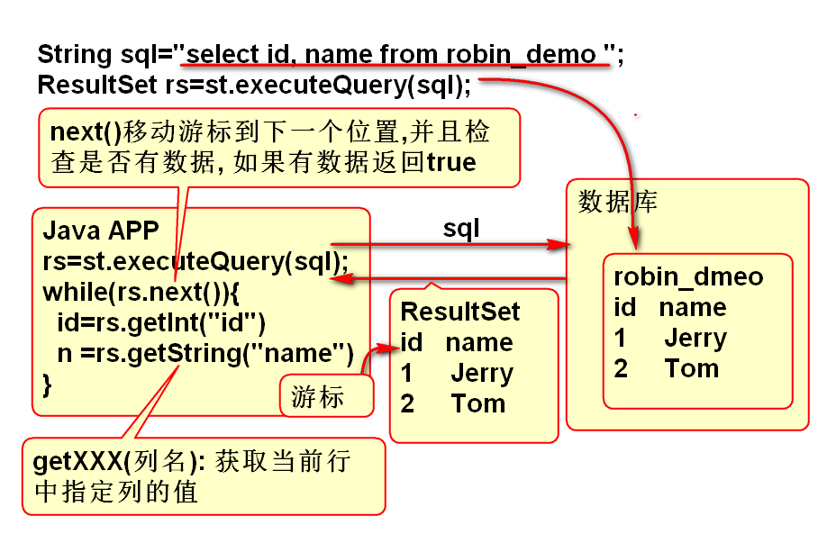

# JDBC

## JDBC 是什么

JDBC是Java应用程序和数据库之间的通信桥梁, 是Java应用程序访问数据库的通道.

1. JDBC标准主要有一组接口组成, 其好处是统一了各种数据库访问方式.
2. JDBC接口的实现类称为数据库驱动,有各个数据库厂商提供. 使用JDBC必须导入这个驱动!

> 一定要知道驱动是什么!!

## 使用JDBC

JDBC使用步骤:

1. 导入JDBC驱动jar
	- 使用Maven可以便捷的导入数据库驱动.
2. 注册JDBC驱动
	- 参数: "驱动程序类名"
	- Class.forName("驱动程序类名")
3. 获得Connection对象
	- 需要3个参数: url, username, password
	- 连接到数据库
4. 创建Statement(语句)对象
	- conn.createStatement() 方法创建对象
	- 用于执行 SQL 语句
	- execute(ddl) 执行任何SQL, 常用执行DDL,DCL
	- executeUpdate(dml) 执行DML语句,如: insert update delete
	- executeQuery(dql) 执行DQL语句, 如: select
5. 处理SQL执行结果:
	- execute(ddl) 如果没有异常则成功.
	- executeUpdate(dml) 返回数字,表示更新"行"数量,抛出异常则失败
	- executeQuery(dql) 返回ResultSet(结果集)对象, 代表2维查询结果, 使用for遍历处理, 如果查询失败抛出异常!
6. 关闭数据连接!关闭数据连接!关闭数据连接!
	- conn.close(); 

案例:

	public class Demo01 {
		public static void main(String[] args)
			throws Exception{
			Class.forName("oracle.jdbc.OracleDriver");
			//System.out.println("OK!");
			//链接到数据库
			String url="jdbc:oracle:thin:@192.168.201.227:1521:orcl";
			String username="openlab";
			String password="open123";
			//getConnection() 方法查找并且尝试
			//链接到数据库, 如果不成功将出现异常
			Connection conn=DriverManager
				.getConnection(
				url, username, password);
			//输出conn引用对象的实际类型
			//证明: 驱动程序提供了Connection接口的实现类
			System.out.println(conn.getClass());
			//创建 "Statement语句" 对象
			Statement st=conn.createStatement();
			//执行SQL(DDL)
			String ddl="create table robin_demo"
					+ "( id number(7),"
					+ "name varchar2(100))";
			boolean b=st.execute(ddl);
			//返回结果: true 表示有结果集
			//          false 没有结果集
			//          创建失败抛出异常
			//如何判断结果:如果没有异常,则创建成功!!
			System.out.println(b); 
			conn.close();
		}
	}

执行 DML 语句 案例:

	/*
	 * 执行DML语句
	 */
	public class Demo02 {
		public static void main(String[] args) 
			throws Exception {
			// 注册驱动
			Class.forName("oracle.jdbc.OracleDriver");
			//连接到数据库
			String url="jdbc:oracle:thin:@192.168.201.227:1521:orcl";
			String username="openlab";
			String password="open123";
			Connection conn=DriverManager.getConnection(
					url, username, password);
			//创建 Statement
			Statement st=conn.createStatement();
			//执行DML, 使用executeUpdate方法
			//String dml="insert into robin_demo"
			//		+ "(id, name) "
			//		+ "values (1,'Tom')";
			//String dml="update robin_demo "
			//		+ "set name='Jerry' "
			//		+ "where id=1 ";
			String dml = "delete from robin_demo "
					+ "where id=1";
			int n=st.executeUpdate(dml);
			System.out.println(n); 
			//关闭连接!!
			conn.close();
			//select * from robin_demo
		}
	}

## 处理结果集ResultSet

ResultSet代表DQL查询结果,是2维结果. 其内部维护了一个读取数据的游标,默认情况在,游标在第一行数据之前, 当调用next() 方法时候, 游标会向下移动,并将返回结果集中是否包含数据, 如果包含数据就返回true. 结果集还提供了很好getXXX方法用于获取结果集游标指向当前行数据.

原理:

案例:

	/**
	 * 执行DQL 语句 
	 */
	public class Demo03 {
		public static void main(String[] args) 
			throws Exception{
			//注册驱动
			String driver="oracle.jdbc.OracleDriver";;
			Class.forName(driver);
			//连接数据库
			String url="jdbc:oracle:thin:@192.168.201.227:1521:orcl";
			String user="openlab";
			String pwd="open123";
			Connection conn=DriverManager.getConnection(
					url, user, pwd);
			//创建Statement
			Statement st=conn.createStatement();
			//执行SQL(dql)
			String sql="select id, name "
					+ "from robin_demo ";
			ResultSet rs=st.executeQuery(sql);
			//处理结果 ...
			//rs结果集中包含一个游标,游标默认在结果集
			//的第一行之前
			//rs.next():移动结果集游标到下一行
			//检查是否有数据, 如果有返回true, 否则false
			while(rs.next()){
				//getXXX(列名): 返回结果集当前行中
				// 指定列名的数据.
				int id = rs.getInt("id");
				String name=rs.getString("name");
				//输出查询结果
				System.out.println(id+","+name);
			}
			//关闭连接
			conn.close();
		}
	}

## 使用Properties 读取配置文件

Properties 是Java中专门用于读取配置文件的API. 

1. 其底层就是文本文件IO
2. Properties 本身 实现 Map接口, 内部是散列表
3. Properties限定了key和Value都是String 类型.

Properties 常用API方法:

- load(流) 读取一个配置文件
- String getProperty(key) 读取一个属性值

使用步骤:

1. 创建Properties对象
2. 利用load方法读取配置文件
3. 利用getProperty查询属性文件的内容

案例, 读取配置文件:

在resource 文件夹中添加配置文件 db.properties:

	# db.properties
	jdbc.driver=oracle.jdbc.OracleDriver
	jdbc.url=jdbc:oracle:thin:@192.168.201.227:1521:orcl
	jdbc.username=openlab
	jdbc.password=open123

使用Properties读取配置文件内容:

	public class Demo05 {
		public static void main(String[] args)
			throws IOException{
			// Properties 就是为了读取
			// *.properties 文件而设计的API
			// 其底层就是文本文件IO
			// Properties 本身 实现 Map接口
			// 内部是散列表, 限定了key和Value都是
			// String 类型.
			
			//方法: load(流) 将文件就读取为散列表
			//String getProperty(key) 查询value
			
			//使用步骤
			//1 创建 Properties 对象
			Properties cfg = new Properties();
			System.out.println(cfg);
			System.out.println(cfg.size());
			System.out.println(cfg.isEmpty());
			//2. 利用load方法读取文件
			InputStream in=
				Demo05.class.getClassLoader()
				.getResourceAsStream("db.properties");
			//执行以后,将文件内容读取到散列表中了
			cfg.load(in); 
			System.out.println(cfg);
			System.out.println(cfg.size());
			
			//3. 查找文件内容, 就是读取文件内容
			String s=
				cfg.getProperty("jdbc.driver");
			System.out.println(s); 
		}
	}

> 利用配置文件可以将程序中的参数保存到配置文件中, 修改程序参数只需要修改配置文件即可.

## 管理数据库连接

在软件中数据库连接使用非常频繁, 如果每次都创建连接, 就会造成代码的大量冗余, 常规的做法是建立数据库连接工具类, 封装数据库连接过程, 统一数据库连接过程, 使用时候就可以简化代码.

实现步骤:

1. 创建数据库连接参数文件 db.properties
2. 创建DbUtils.java 封装数据库连接方法
	- 利用Properties读取配置文件夹中的数据库连接参数
	- 创建方法 getConnection 封装数据库连接过程
3. 使用 getConnection 方法

### 创建配置文件  db.properties

	# db.properties
	jdbc.driver=oracle.jdbc.OracleDriver
	jdbc.url=jdbc:oracle:thin:@192.168.201.227:1521:orcl
	jdbc.username=openlab
	jdbc.password=open123

### 创建DbUtils.java

	public class DbUtils {
		static String driver;
		static String url;
		static String username;
		static String password;
		
		//读取文件中的数据库连接参数
		static{
			//初始化静态属性
			//1. 利用Properties 读取配置文件
			//2. 从配置文件中查找 相应参数值
			try{
				Properties cfg=new Properties();
				InputStream in=
					DbUtils.class.getClassLoader()
					.getResourceAsStream("db.properties");
				cfg.load(in);
				System.out.println(cfg); 
				//初始化 连接参数 
				driver=cfg.getProperty("jdbc.driver");
				url=cfg.getProperty("jdbc.url");
				username=cfg.getProperty("jdbc.username");
				password=cfg.getProperty("jdbc.password");
				in.close();
			}catch(Exception e){
				e.printStackTrace();
				throw new RuntimeException(e);
			}
		}
		
		/**
		 * 封装创建数据库连接的过程
		 * 简化数据库连接
		 */
		public static Connection getConnection(){
			try{
				Class.forName(driver);
				Connection conn=
					DriverManager.getConnection(
					url, username, password);
				return conn;
			}catch(Exception e){
				e.printStackTrace();
				throw new RuntimeException(e);
			}
		}
		
		//DbUtils.java
		/*
		 * 关闭数据库的连接方法, 封装复杂的关闭过程
		 */
		public static void close(Connection conn){
			if(conn!=null){
				try {
					conn.close();
				} catch (Exception e) {
					e.printStackTrace(); 
				}
			}
		}
	}

说明:

1. driver url username password 是4个数据库连接参数, 因为只需要一份,则定义为静态变量.
2. 静态代码块的目的是从配置文件中读取4个数据库连接参数的值.
3. getConnection方法封装了数据库连接过程
4. close方法封装了数据库连接关闭的过程

### DbUtils 的使用:

	public class Demo06 {
		public static void main(String[] args) {
			Connection conn=null;
			try{
				conn=DbUtils.getConnection();
				Statement st=conn.createStatement();
				String sql="select * from robin_demo";
				ResultSet rs=st.executeQuery(sql);
				while(rs.next()){
					int id=rs.getInt("id");
					String name=rs.getString("name");
					System.out.println(id+","+name);
				}
				rs.close();//释放查询结果
				st.close();//释放语句对象
			}catch(Exception e){
				e.printStackTrace();
			}finally {
				DbUtils.close(conn);
			}
		}
	}

> 显然: 使用DbUtils可以简化JDBC代码的书写. 
> 这个代码中在finally中关闭数据库连接, 其好处是可靠关闭连接.

-------------------------------

## 作业:

1. 创建新的Maven项目导入Oracle数据库驱动
2. 独立编写数据库连接管理工具类 DbUtils
3. 利用DbUtils实现员工表的 插入操作
4. 利用DbUtils实现员工表的 修改操作
5. 利用DbUtils实现员工表的 删除操作
6. 利用DbUtils实现员工表的 查询操作

