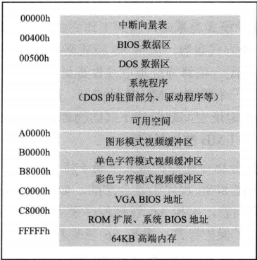
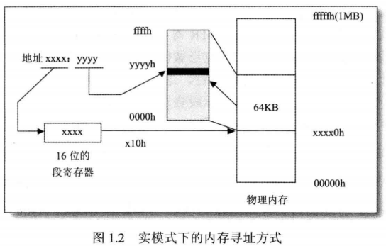

# 一、基础篇
##  第一章 背景知识
###  1.win32的软硬件平台
####  1.1 80x86 系列处理器简史
####  1.2 Windows 的历史
####  1.3 Windows 平台的背后——Wintel联盟
###  2.Windows 的特色
###  3.必须了解的基础知识
####  3.1 80x86处理器的工作模式
   > 80386有3种工作模式：实模式、保护模式和虚拟86模式
    
    实模式：
        1）实模式不支持优先级，可以执行所有特权指令
        2）不能对内存进行分页管理，所以指令寻址的地址就是内存种实际的物理地址。
        3） 加载CR0 修改保护模式位置位进入保护模式
        4） 实模式不支持硬件上的多任务切换

     保护模式：
        1） 保护模式是80386主要工作模式
        2） 支持内存分页机制，提供对虚拟内存的良好支持
        3） 支持优先级机制，不同程序运行在不同的优先级（0级-3级），操作系统在最高的0级，应用程序在比较低的级别。
        4）Dos运行在实模式下，Windows运行在保护模式下。
        5）实模式切换到保护模式过程：修改控制寄存器CR0的控制位PE（位0）实现。修改前需要建立保护模式必须的数据表。如全局描述符表GDT和中断描述符表IDT等。

     虚拟86模式
        1） 虚拟86模式是为了在保护模式下执行8086程序而设置的。
        2）此模式下80386支持任务切换和内存分页
        3) Windows操作系统中，有一部分程序专门用来管理虚拟86模式的任务，称为虚拟86管理程序
        4）实际上是实模式和保护模式的混合。

   > 实模式和虚拟86模式是为了兼容8086处理器

   

####  3.2 Windows 的内存管理
  > DOS系统的内存安排，如下图

   

  > 实模式的寻址方式

   

  > 80386的内存寻址机制

    80386中任何一个通用寄存器都可以间接寻址，不需要分段就可以访问到所有内存地址。
    
    段寄存器(16位)用来存储地址空间定义上的属性 和 保护模式下段的其他参数等信息。（要用64位长的数据才能表示）

    这64位长的属性数据叫做段描述符（Segment Descriptor）

    段描述符表（Descriptor Table）：所有段的段描述符顺序放在内存中的指定位置，组成了段描述符表    

    段选择器（Segment Selector）：段寄存器中的16位用来做索引信息，指定这个段的属性用段描述符表中的 第几个描述符来表示。

    可以通过段选择器在段描述符表中选择一个项目以得到段的全部信息。

    段描述符表寄存器 ：
        1） GDTR（Global Descriptor Table） ： 48位的全局描述符表寄存器，包含系统中所有任务都可用的段描述符。通常包括描述操作系统所使用的代码段、数据段、和堆栈段的描述符及各任务的LDT段等。仅有1个。
        2）LDTR（Local Descriptor Table）： 16位的局部描述符表寄存器。80386中每个任务都有一个独立的LDT。它包含每个任务私有的代码段、数据段和堆栈段的描述符。也包含该任务所使用的门描述符，如任务门和调用门描述符等。
    
    不同任务的局部描述符表分别组成不同的内存段，描述这些内存段的描述符当作系统描述符放在全局描述符表中。
####  3.3 Windows 的特权保护

---
 

## 第二章 准备编程环境
###  1.Win32可执行文件的开发过程
###  2 编译器和链接器
####  2.1 MASM系列
####  2.2 TASM系列
####  2.3 其他编译器
####  2.4 MASM，TASM还是NASM
####  2.5 我们的选择——MASM32 SDK软件包
###  3.创建资源
####  3.1资源编译器的使用
####  3.2所见即所得的资源编辑器
###  4.make工具的用法
####  4.1 make工具是什么
####  4.2 make的用法
####  4.3 描述文件的语法
###  5.获取资料
####  5.1 Windows资料的来源
####  5.2 Intel处理器资料
###  6.构建编程环境
####  6.1 IDE还是命令行
####  6.2 本书推荐的工作环境
####  6.3 尝试编译第一个程序

---
 

## 第三章 使用MASM
### 1.Win32汇编源程序的结构
####  1.1 模式定义
####  1.2 段的定义
####  1.3 程序结束和程序入口
####  1.4 注释和换行
### 2.调用API
####  2.1 API是什么
####  2.2 调用API
####  2.3 API参数中的等值定义
### 3.标号、变量和数据结构
####  3.1 标号
####  3.2 全局变量
####  3.3 局部变量
####  3.4 数据结构
####  3.5 变量的使用
### 4.使用子程序
####  4.1 子程序的定义
####  4.2 参数传递和堆栈平衡
### 5.高级语法
####  5.1条件测试语句
####  5.2 分支语句
####  5.3 循环语句
### 6.代码风格
####  6.1 变量和函数的命名
####  6.2 代码的书写格式
####  6.3 代码的组织

---

 
 

# 初级篇
## 第四章 第一个窗口程序
### 1.开始了解窗口
#### 1.1 窗口是什么
#### 1.2 窗口界面
#### 1.3 窗口程序是怎么工作的
### 2.分析窗口程序
####  2.1 模块和句柄
####  2.2 创建窗口
####  2.3 消息循环
####  2.4 窗口过程
### 3.窗口间的通信
####  3.1 窗口间的消息互发
####  3.2 在窗口间传递数据
####  3.3 SendMessage 和 PostMessage 函数的区别

---
 

## 第五章 使用资源
### 1. 菜单和加速键
####  1.1 菜单和加速键的组成
####  1.2 菜单的加速键的资源定义
####  1.3 使用菜单和加速键
### 2.图标和光标
####  2.1 图标和光标的资源定义
####  2.2 使用图标和光标
### 3.位图
####  3.1 位图简介
####  3.2 在资源中定义位图
### 4. 对话框
####  4.1 对话框简介
####  4.2 对话框的资源定义
####  4.3 使用对话框
####  4.4 在对话框中使用子窗口控件
### 5.字符串资源
### 6.版本信息资源
#### 6.1 版本信息资源的定义
####  6.2 在程序中检测版本信息
### 7. 二进制资源和自定义资源
#### 7.1 使用二进制资源
#### 7.2 使用自定义资源

---
 

## 第六章 定时器和Windows 时间
### 1.定时器
#### 1.1 定时器简介
#### 1.2 定时器的使用方法
### 2.Windows 时间
#### 2.1 Windows 时间的获取和设置
#### 2.2 计算时间间隔

---
 

## 第七章 图形操作
### 1.GDI原理
#### 1.1 GDI程序的结构
#### 1.2 设备环境
#### 1.3 色彩和坐标
### 2.绘制图形
#### 2.1 画笔和笔刷
#### 2.2 绘制像素点
#### 2.3 绘制图形
#### 2.4 绘图模式
### 3. 创建和使用位图
#### 3.1 一个使用位图的时钟例子
#### 3.2 创建和使用位图
#### 3.3 使用设备无关位图
### 4. 块传送操作
#### 4.1 块传送方式
#### 4.2 块传送函数
### 5.区域和路径
#### 5.1 使用区域
#### 5.2 使用路径

---
 
 

# 界面篇
## 第八章 通用对话框
### 1. 通用对话框简介
### 2. 使用通用对话框
#### 2.1 打开文件和保存文件对话框
#### 2.2 字体选择对话框
#### 2.3 颜色选择对话框
#### 2.4 查找和替换文本对话框
#### 2.5 页面设置对话框
#### 2.6 浏览目录对话框

---
 

## 第九章 通用控件
### 1. 通用控件简介
#### 1.1 通用控件的分类
#### 1.2 使用通用控件
### 2. 使用状态栏
#### 2.1 创建状态栏
#### 2.2 状态栏的控制消息
#### 2.3 在状态栏上显示菜单提示消息
### 3. 使用工具栏
#### 3.1 创建工具栏
#### 3.2 工具栏的控制消息
#### 3.3 工具栏的通知消息
### 4. 使用Richedit控件
#### 4.1 创建Richedit 控件
#### 4.2 Richedit 控件的控制消息
#### 4.3 Richedit 控件的通知消息
### 5.窗口的子类化
#### 5.1 什么是窗口的子类化
#### 5.2 窗口子类化的实现
### 6. 控件的超类化
#### 6.1 什么是控件的超类化
#### 6.2 控件超类化的实现

---
 
 

# 系统篇
## 第十章 内存管理和文件操作
### 1.内存管理
#### 1.1 内存管理基础
#### 1.2 内存的当前状态
#### 1.3 标准内存管理函数
#### 1.4 堆管理函数
#### 1.5 虚拟内存管理函数
#### 1.6 其他内存管理函数
### 2.文件操作
#### 2.1 Windows 的文件I/O
#### 2.2 创建和读写文件
#### 2.3 查找文件
#### 2.4 文件属性
#### 2.5 其他文件操作
### 3.驱动器和目录
#### 3.1 逻辑驱动器操作
#### 3.2 目录操作
### 4.内存映射文件
#### 4.1 内存映射文件简介
#### 4.2 使用内存映射文件

---
 

## 第十一章 动态链接库和钩子
### 1.动态链接库
#### 1.1 动态链接库的概念
#### 1.2 编写动态链接库
#### 1.3 使用动态链接库
#### 1.4 动态链接库中的数据共享
#### 1.5 在VC++中使用动态链接库
### 2.Windows 钩子
#### 2.1 什么是Windows钩子
#### 2.2 远程钩子的安装和使用
#### 2.3 日志记录钩子

---
 

## 第十二章 多线程
### 1.进程和线程
### 2.多线程编程
#### 2.1 一个单线程的问题程序
#### 2.2 多线程的解决方法
#### 2.3 与线程有关的函数
### 3.使用事件对象控制线程
#### 3.1 事件
#### 3.2 等待事件
#### 3.3 进一步改进计数程序
### 4.线程间的同步
#### 4.1 产生同步问题的原因
#### 4.2 各种用于线程间同步的对象

---
 

## 第十三章 过程控制
### 1. 环境变量和命令行参数
#### 1.1 环境变量
#### 1.2 命令行参数
### 2.执行可执行文件
#### 2.1 方法一：Shell 调用
#### 2.2 方法二：创建进程
### 3. 进程调试
#### 3.1 获取运行中的进程句柄
#### 3.2 读写进程的地址空间
#### 3.3 调试API的使用
### 4. 进程的隐藏
#### 4.1 在Windows 9x中隐藏进程
#### 4.2 Windows NT中的远程线程

---
 

## 第十四章
### 1. 异常处理的用途
### 2. 使用筛选器处理异常
#### 2.1 注册回调函数
#### 2.2 异常处理回调函数
### 3. 使用SEH处理异常
#### 3.1 注册回调函数
#### 3.2 异常处理回调函数
#### 3.3 SEH链和异常的传递
#### 3.4 展开操作

---
 

## 第十五章 注册表和INI文件
### 1. 注册表和INI文件简介
### 2. INI文件的操作
#### 2.1 INI文件的结构
#### 2.2 管理键值
#### 2.3 管理小节
#### 2.4 使用不同的INI文件
### 3. 对注册表的操作
#### 3.1 注册表的结构
#### 3.2 管理子键
#### 3.3 管理键值
#### 3.4 子键和键值的枚举
#### 3.5 注册表应用举例

---
 

## 第十六章 WinSock接口和网络编程
### 1. Windows Socket 接口简介
### 2. Windows Socket 接口的使用
#### 2.1 IP地址的转换
#### 2.2 套接字
#### 2.3 网络应用程序的一般工作流程
#### 2.4 监听、发起连接和接收连接
#### 2.5 数据的收发
#### 2.6 一个最简单的TCP服务端程序
### 3. TCP 应用程序的设计
#### 3.1 通信协议和工作线程的设计
#### 3.2 TCP聊天室例子——服务器端
#### 3.4 以非阻塞方式工作的TCP聊天室客户端
#### 3.5 其他常用函数

---
 

## 第十七章 PE文件
### 1. PE文件的结构
#### 1.1 概论
#### 1.2 DOS文件头和DOS块
#### 1.3 PE文件头（NT文件头）
#### 1.4 节表和节
### 2. 导入表
#### 2.1 导入表简介
#### 2.2 导入表的结构
#### 2.3 查看PE文件导入表举例
### 3. 导出表
#### 3.1 导出表的结构
#### 3.2 查看PE文件导出表举例
### 4. 资源
#### 4.1 资源简介
#### 4.2 资源的组织方式
#### 4.3 查看PE文件中的资源列表举例
### 5. 重定位表
#### 5.1 重定位表的结构
#### 5.2 查看PE文件的重定位表举例
### 6. 应用举例
#### 6.1 动态获取API入口地址
#### 6.2 在PE文件上添加执行代码

---
 

## 第十八章
### 1.基础知识
#### 1.1 数据库接口的发展历史
#### 1.2 SQL语言
#### 1.3 ODBC程序的流程
### 2.连接数据库
#### 2.1 连接和断开数据库
#### 2.2 连接字符串
### 3. 数据的管理
#### 3.1 执行SQL语句
#### 3.2 执行结果的处理
#### 3.3 获取结果集中的数据
#### 3.4 事务处理
### 4. 数据库操作的例子
#### 4.1 结果集处理模块
#### 4.2 例子的源代码

