# 第一部分 PE的原理和基础

## 第一章 Windows PE 开发环境

### 1、开发语言 MASM32

1. 设置开发环境
2. 开发第一个源程序HelloWorld.asm
3. 运行HelloWorld.exe

### 2、调试软件OllyDBG

1. 调试HelloWord.exe
2. 修改EXE文件字节码

### 3、十六进制编辑软件 FlexHex

### 4、破解实例：U盘监控器

### 5、初始识PE文件

> 小诀窍！！！

如果当前没有合适的软件，但是想获取FlexHEX 这样的十六进制格式字节码内容。
可以使用下面的步骤：
1. 生成1.txt文件，输入的内容如下：
d
d
...
d
q

d字符个数的计算公式为： d字符的个数 = 文件大小 / （16*8）

2. 将demo.exe 更改为 123，不要加扩展名

3. 命令提示符下运行命令： Debug 123<1.txt>2.txt

这样就可以生成啦~

---

## 第二章 三个小工具的编写

### 1、构造基本窗口程序

1. 构造窗口界面
2. 编写相关的资源文件
3. 通用程序框架的实现

### 2、PEDump的实现

1. 编程思路
2. PEDumo 编码
3. PEDump 代码中的数据结构
4. 运行PEDump

### 3、PEComp的实现

1. 编程思路
2. 定义资源文件
3. PEComp编码
4. 运行PEComp

### 4、PEInfo 的实现

1. 编程思路
2. PEInfo编码
3. 运行PEInfo

---

## 第三章 PE文件头

### 1、PE的数据组织方式

### 2、与PE有关的基本概念

1. 地址

   > 虚拟内存

     windows 采用分页机制进行内存管理。分页机制可以使用户产生每一个进程都拥有4GB空间的错觉。操作系统按照 某个固定的大小 （4KB），将4GB空间分成N（1M）页。在某一时刻，所有这些页 和 实际物理内存之间 只有一部分是对应的。其他没有物理内存对应的页，被标记为脏页面。脏页面被存储在交换文件中。当系统需要读取 不在内存中的数据时，系统会将 内存中不经常读写的页交换出内存，而把要读取的，位于交换文件中的页换进内存。利用这种机制管理的内存被称为 虚拟内存。

   > 虚拟内存地址（Virtual Address） VA : 虚拟内存中的地址

   > 相对虚拟内存地址（Reverse Virtual Address） RVA

    当进程被加载进虚拟内存时，与其相关的静态链接库也会被加载，这些静态链接库加载进内存后又被称为模块，每一个模块都有一个基地址。
    RVA 是相对于基地址的偏移。即RVA是相对于虚拟内存中用来定位某个特定位置的地址。地址的值是这个特定位置距离某个模块基地址的偏移量。RVA是针对某个模块存在的。

   > 文件偏移地址（File Offset Address） FOA ： 和内存无关，它是指某个位置距离文件头的偏移。

   > 特殊地址：计算方法是从某个特定的位置算起。

2. 指针

PE数据结构中的指针定义： 如果一个数据结构中存储的是一个地址，那么这个结构就是一个指针结构。

3. 数据目录

记录所有可能的数据类型：导出表、导入表、资源表、异常表、属性证书表、重定位表、调试数据、Architecture、Global Ptr、线程局部存储、加载配置表、绑定导入表、IAT、延迟导入表和CLR运行时头部。

4. 节

存放不同类型数据（代码、数据、常量、资源等）的地方，不同的节具有不同的访问权限。
节是PE文件中存放代码或数据的基本单元。
从操作系统来看：节是相同属性数据的组合。尽管有些数据类型不同，分别属于不同的数据目录，但由于访问属性相同，便被归类到同一个节中。
相同页面的节具有相同的访问属性。

windows 操作系统装载PE文件时会对这些数据执行抛弃、合并、新增、复制等操作。

5. 对齐

PE规定了三类对齐

   > 数据在内存中的对齐

    由于Windows 操作系统中，对内存属性的设置是以页为单位。
    所以通常情况下， 节在内存中的对齐单位至少是一个页的大小。
    对于32位操作系统： 1页 = 4KB （1000H）
    64位： 1页 = 8KB（2000H）

   > 数据在文件中的对齐

    为了提高磁盘利用率。节在文件中的对齐单位要远小于内存对齐的单位。
    通常以一个物理扇区的大小作为对齐粒度的值。即512字节 （200H）
    通常情况下，PE在内存中的尺寸要比在文件中的尺寸大。

    注：如果内存对齐被定义为小于操作系统页的大小，则文件对齐和内存对齐的值必须一致。

   > 资源数据对齐

    资源文件中，资源字节码一般要求以双字（4字节）方式对齐。

6. Unicode字符串

### 3、PE文件结构

1. 16位系统下的PE结构

        在16位系统下，PE结构大致可以划分两部分：DOS头和冗余数据。

        DOS头 = DOS MZ 头 + DOS Stub（指令代码）
        冗余数据 = PE头 + PE数据区

    > DOS MZ 头

    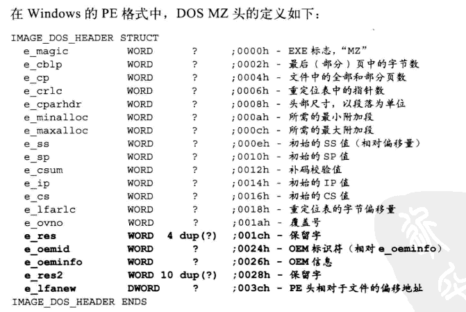

    > DOS Stub

    由于DOS Stub 的大小不固定，因此DOS头的大小也是不固定的。

2. 32位系统下的PE结构

    在16位操作系统中，PE头和PE数据部分被当成是冗余数据；
    在32位系统中，刚好相反，DOS头成为冗余数据。
    尽管DOS头不参与32位操作系统运行过程。但也不能去除这些数据。

    因为在DOS MZ头中有一个字段非常重要 ： <b>IMAGE_DOS_HEADER.e_lfanew</b> 没有它操作系统就定位不到标准的PE头部，可执行程序就会被操作系统认为是非法的PE映像。

   > 定位标准PE头

    字段e_lfanew 用来定位后面的标准PE头部。
    该字段的值是一个相对偏移量。绝对定位时，需要加上DOS MZ头的基地址。
    获取PE头的绝对位置 ：

    PE_start = DOS MZ 基地址 + IMAGE_DOS_HEADER.elfanew
    = 13B7:0100 + 0000 00B0H
    = 13B7:01B0

   > PE 文件结构

    在32位系统下，最重要的部分就是PE头和PE数据区。
    PE结构可以划分为5个部分：
    DOS MZ头、DOS Stub 、PE头、节表和节内容

    <b style = 'color:red'>DOS MZ 头的大小是64个字节(固定不变)</b> 

    PE头的大小是456个字节（<b style = 'color:red'>由于数据目录表项不一定是16个，所以准确的说，PE头也是一个不能确定大小的结构。该结构的实际大小由字段IMG_FILE_HEADER.SizeOfOptionalHeader来确定。</b> ）

    节表的大小不固定，是因为每个PE中节的数量不固定。
    <b style = 'color:red'>每个节的描述信息则是个固定值，共40字节。</b> 
    节表 = 不确定数量的节描述信息 组成 = n* 40 字节 （n=节）
    节的数量由字段IMAGE_FILE_HEADER.NumberOfSections来定义。

    DOS Stub 和节内容都是大小不确定的。

   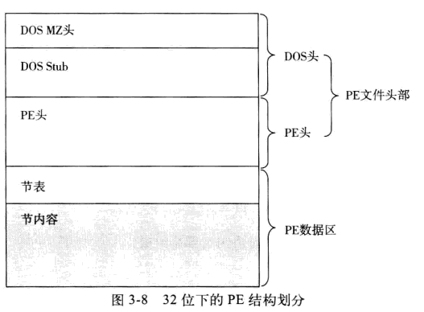

3. 程序员眼中的PE结构

    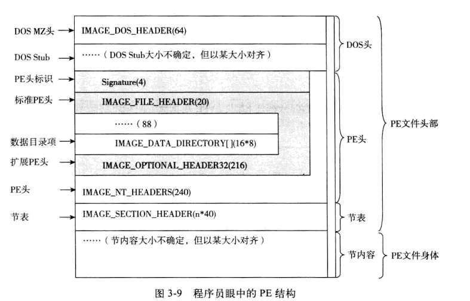

    标准PE文件 = DOS头 + PE头（IMAGE_NT_HEADERS） + 节表（多个IMAGE_SECTION_HEADER结构）+ 节内容

    PE 头 = Signature（4个字节的标识符号） + IMAGE_FILE_HEADER（20个字节的基本头信息） + IMAGE_OPTIONAL_HEADER32（216个字节的扩展头信息）

    PE文件 = PE文件头部 + PE文件身体（节内容）

    PE文件头部 = DOS头 + PE头 + 节表

### 4、PE文件头部解析

1. DOS MZ头 IMAGE_DOS_HEADER

    重复一遍！
    

   > 注释后的偏移是基于IMAGE_DOS_HEADER 头的

   > DOS MZ头的下面是DOS Stub。整个DOS Stub 是一个字节块。内容随着链接器的不同而不同。PE中并没有与之对应的相关结构。

2. PE 头标识 Signature

        位置：紧跟DOS Stub之后: DOS MZ 头基地址 + IMAGE_DOS_HEADER.e_lfanew
        内容： 固定为ASCII码的字符串：“PE\0\0”
        占用字节：4个字节

3. 标准PE 头 IMAGE_FILE_HEADER

        位置： DOS MZ 头基地址 + IMAGE_DOS_HEADER.e_lfanew + 4
        内容：数据结构为 IMAGE_FILE_HEADER 的内容。
        占用字节：20个 字节

    > IMAGE_FILE_HEADER 格式如下：

    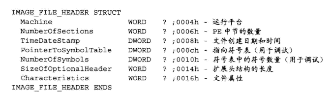

    > 这里存储的数据结构在微软的官方文档中称为标准通用对象文件格式（Common Object File Format，COFF）  头。记录PE文件的全局属性

    > 文件中指向的偏移 是基于 IMAGE_NT_HEADERS头的

4. 扩展PE头 IMAGE_OPTIONAL_HEADER

        位置：
        内容：COFF 头定义如下图
        占用字节：216个字节

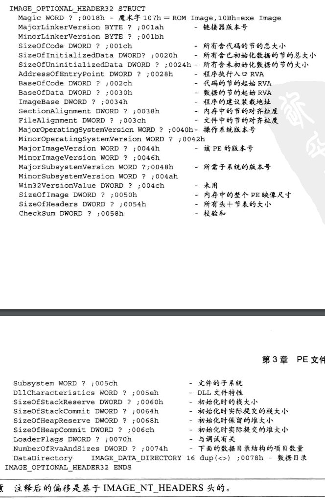

5. PE头IMAGE_NT_HEADERS

    > 广义上的PE头，标准的PE文件中，大小为456个字节。严格来说，这是概念意义上的定义

        位置：DOS MZ 头基地址 + IMAGE_DOS_HEADER.e_lfanew
        内容：Signature + IMAGE_FILE_HEADER + IMAGE_OPTIONAL_HEADER
        占用字节：标准的PE文件中为：456个字节

    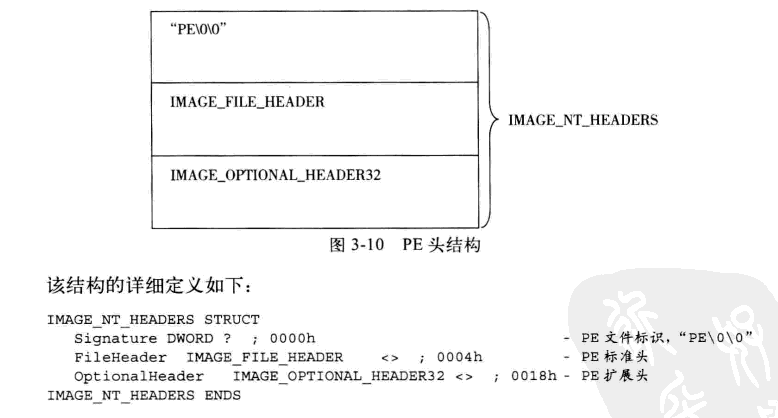

6. 数据目录项IMAGE_DATA_DIRECTORY

        位置：IMAGE_OPTIONAL_HEADER.DataDirectory +IMAGE_OPTIONAL_HEADER 基地址
        内容：定义了PE文件中出现的所有不同类型的数据的目录信息。
        字节：n*8 (n最大为16 n=IMAGE_OPTIONAL_HEADER.NumberOfRvaAndSizes)

    > IMAGE_DATA_DIRECTORY 定义如下：

    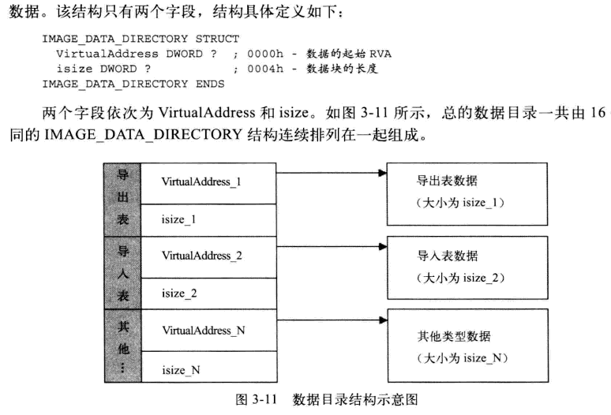

    > 16个元组每一项代表的数据类型如下：

    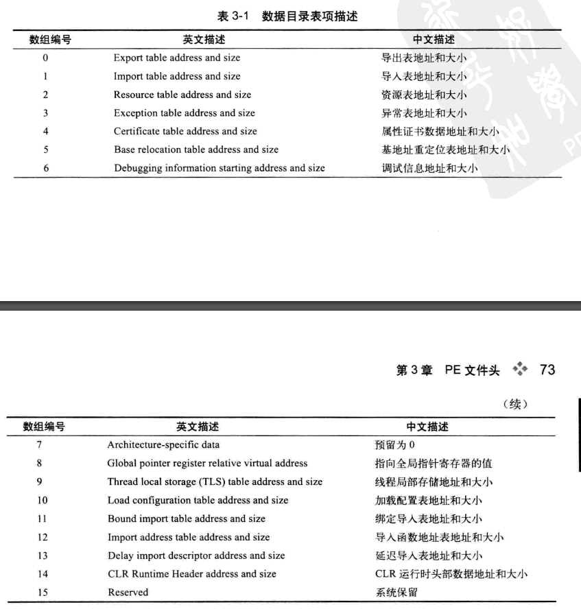

    > 展开后的偏移结构

    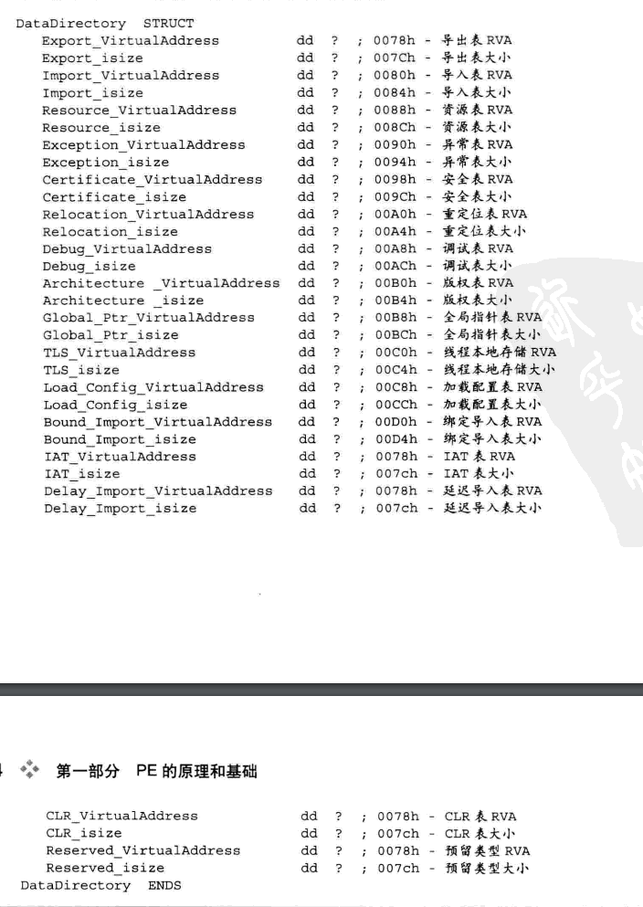

    > 上图结构在PE中并不存在！这里仅是为了方便以后编程时作为参考

7. 节表项IMAGE_SECTION_HEADER

        位置：
        内容：每个节表项都记录了PE中某个特定的节的信息（属性，大小，内存中的位置等。）
        字节：n*40 (n=节表数量)

    > 具体结构如图：

  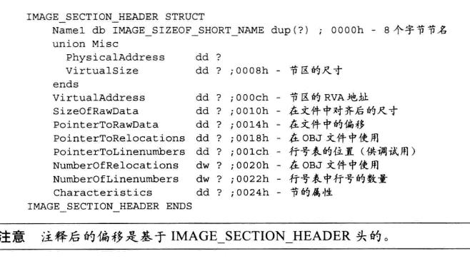

### 5、数据结构字段详解

1. PE头 IMAGE_NT_HEADER的字段

    - IMAGE_NT_HEADER.Signature

        +000H,双字。PE文件标识。
         <b style = 'color:red'>被定义为：0000 4550H</b>也就是PE两个字符 加上 0.
         修改PE文件标识会导致PE文件在32位系统中加载失败。可以通过windows PE 启动盘对疑是病毒文件进行修改，防止开机病毒文件加载。

    - IMAGE_NT_HEADER.FileHeader

        +0004H,结构。该结构指向IMAGE_FILE_HEADER ，由于PE扩展通用COFF规范，所以提，该字段在官方文档中被称为标准COFF头。

    - IMAGE_NT_HEADER.OptionalHeader

        +0018H，结构。指向IMAGE_OPTIONAL_HEADER32。可执行文件的大部分特性都在这个结构中。
        可选头分为两个部分：前10个字段原属于COFF，用来加载和运行一个可执行文件。后21个字段则是通过链接器追加，作为PE扩展的部分。用户描述可执行文件的一些信息，供PE加载器加载使用。

2. 标准PE头IMAGE_FILE_HEADER的字段

    - IMAGE_FILE_HEADER.Machine

        +0004H，单字。指定PE文件运行的平台。具体取值含义如下：

        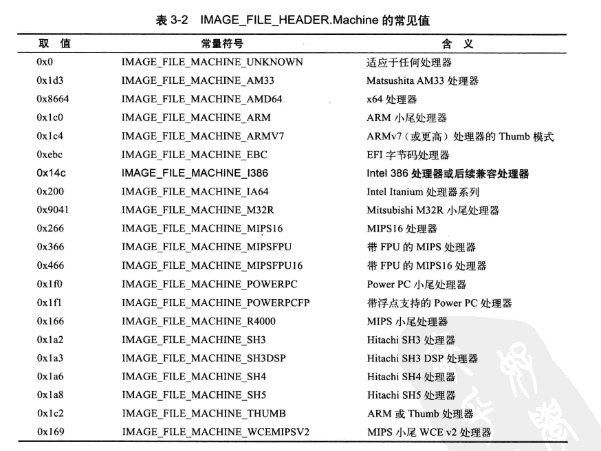

    - IMAGE_FILE_HEADER.NumberOfSections

        +0006H,单字。文件中存在的节的总数。xp中，可以有0个节，但数值不能小于1，也不能超过96.如果此处设置0，装载程序时会提示：不是有效的Win32程序  
        这个值不能比实际内存中存在的节多，也不能比它少。否在装载时会发生错误，提示：不是有效的Win32应用程序。
        删除或修改节的数量时，这里需要改变。
    
    - IMAGE_FILE_HEADER.TimeDateStamp

        +0008H，双字。编译器创建此文件时的时间戳。低32位存放自1970.1.1到创建时间为止的总秒数。
        这个数值可以修改不会影响程序运行。对用户创建的文件并没有任何意义。这里与文件属性的三个时间并无关系。

    - IMAGE_FILE_HEADER.PointerToSymbolTable

        +000CH，双字。COFF符号表的文件偏移。如果不存在COFF符号表，此值为0.对于映像文件来说，此值为0.微软已经不赞成在PE中使用COFF调试信息。

    - IMAGE_FILE_HEADER.NumberOfSymbols

        +0010H,双字。符号表中元素的数目。由于字符串表紧跟在符号表后，可以利用这个值来定位字符串表。对于映像文件来说，此值为0，主要用于调试。

    - IMAGE_FILE_HEADER.SizeOfOptionalHeader

        +0014H，单字。<b style = 'color:red'>指定结构IMAGE_OPTIONAL_HEADER32的长度,默认情况等于00E0H，64位文件默认为00F0H</b>

        修改这个值时需注意两点：1.改完之后需要自行扩充IMAGE_OPTIONAL_HEADER32的大小 2.扩充后，要维持文件对齐特性。此处增加8个字节，后面也要对应删除8个字节。

    - IMAGE_FILE_HEADER.Characteristics

        +0016H,单字。文件属性标志字段。每一个比特位代表含义如下：

        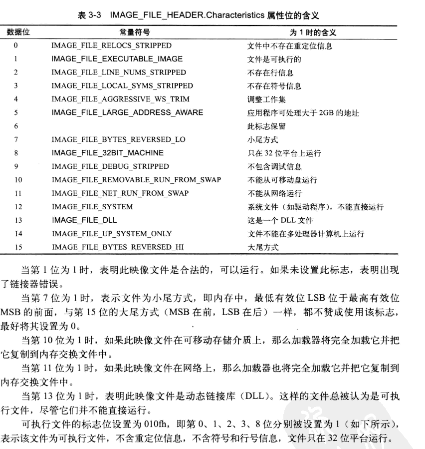

3. 扩展PE头 IMAGE_OPTIONAL_HEADER32的字段

    - IMAGE_OPTIONAL_HEADER32.Magic

        +0018H,单字。魔术字。说明文件类型。010BH，文件为PE32，0107H，文件为ROM映像，020BH，文件为PE32+，即64位下的PE文件。

    - IMAGE_OPTIONAL_HEADER32.LinkerVersion
    - IMAGE_OPTIONAL_HEADER32.MinorLinkerVersion

        +001AH,单字。两个字段都是字节型，指定链接器版本号，对执行无影响。

    - IMAGE_OPTIONAL_HEADER32.SizeOfCode

        +001CH，双字。所有代码节的总和。该大小是基于文件对齐后的大小，而非内存对齐后的大小。
        <b style = 'color:red'>判断某个节是否包含代码：根据节的属性中是否含有IMAGE_SCN_CNT_CODE 标志去判断，而非IMAGE_SCN_MEM_EXECUTE标志</b>

    - IMAGE_OPTIONAL_HEADER32.SizeOfInitializedData

        +0020H,双字。所有包含已经初始化的数据的节的总大小。

    - IMAGE_OPTIONAL_HEADER32.SizeOfUninitializedData

        +0024H,双字。所有包含未初始化的数据的节的总大小。这些数据被定义为未初始化，在文件中不占用空间，被加载进内存后，PE加载程序应该为这些数据分配适当大小的虚拟地址空间。

    - IMAGE_OPTIONAL_HEADER32.AddressOfEntryPoint

        +0028H,双字。该字段的值是一个RVA，记录了启动代码距离该PE加载后的起始位置到底有多少个字节。

        如果在一段可执行文件中植入了自己的代码，并让自己代码执行，一般要修改这里的值，使之指向自己的代码入口位置。
        对于一般程序映像来说，它就是启动地址；
        对于设备驱动程序来说，它是初始化函数的地址；
        入口点对DLL来说是可选的，如果不存在入口点这个字段必须设置为0

         <b style = 'color:red'>许多病毒程序、加密程序、补丁程序都会劫持这里的值，使其指向其他用途的代码。</b>

    - IMAGE_OPTIONAL_HEADER32.BaseOfCode

        +002CH,双字。代码节的起始RVA。表示映像被加载进内存时代码节的开头相对于映像基址的偏移地址。一般情况，代码节紧跟在PE头部后面，节的名称通常为 .text

    - IMAGE_OPTIONAL_HEADER32.BaseOfData

        +0030H,双字。数据节的起始RVA。表示映像被加载进内存时数据节的开头相对于映像基址的偏移地址。一般情况，数据节位于文件末尾，节的名称通常为 .data

    - IMAGE_OPTIONAL_HEADER32.ImageBase

        +0034H,双字。指出了PE映像的优先装入地址。也就是在IMAGE_OPTIONAL_HEADER32.AddressOfEntryPoint中的程序被加载到内存后的起始VA。

        链接器在产生可执行文件的时候，是对应这个地址来生成机器码的。如果操作系统也按照这个地址加载机器码到内存中，那么指令中的许多重定位信息就不需要修改，这样运行速度会更快。

        对于EXE文件来说，每个文件使用的都是独立的虚拟地址空间，所以，优先装入的地址通常不会被其他模块占据。也就是说，EXE文件总是能按照这个地址装入，这就意味着装入后的EXE文件不需要进行重定位。

        链接的时候，可以使用参数 -base 来指定优先装入的地址，如果不指定，默认EXE地址：0x00400000H，DLL默认地址：0x10000000H，如果一个进程用到了多个DLL文件，装入地址可能会发生冲突。PE加载器会调整其中的地址，使所有的DLL文件都能被正确装入。
        所以并不是内存中动态链接库的基地址和文件头字段IMAGE_OPTIONAL_HEADER32.ImageBase 指定的完全一样。

        可以自己定义这个值，但是取值有限制：第一、取值不能超出边界，取值必须在进程地址空间中。二、该值必须是64KB的整数倍。

    - IMAGE_OPTIONAL_HEADER32.SectionAlignment

        +0038H,双字。内存中节的对齐粒度。指定了节被装入内存后的对齐单位。

        Win32页面大小是4KB，所以Win32 PE中节的内存对齐粒度一般都选择4KB大小。十六进制表示为：01000H

        SectionAlignment 必须 大于 或等于 FileAlignment。当它小于系统页面大小时，必须保证 SectionAlignment 和 FileAlignment 相等。

    - IMAGE_OPTIONAL_HEADER32.FileAlignment

        +003CH,双字，文件中节的对齐粒度。

    - IMAGE_OPTIONAL_HEADER32.MajorOperatingSystemVersion
    - IMAGE_OPTIONAL_HEADER32.MinorOperatingSystemVersion

        +0040H, 以上两个字段都为单字。标识操作系统的版本号，分别为主版本号和次版本号。

    - IMAGE_OPTIONAL_HEADER32.MajorImageVersion
    - IMAGE_OPTIONAL_HEADER32.MinorImageVersion

        +0044H, 以上两个字段都为单字。标识PE文件映像的版本号，分别为主版本号和次版本号。

    - IMAGE_OPTIONAL_HEADER32.MajorSubsystemVersion
    - IMAGE_OPTIONAL_HEADER32.MinorSubsystemVersion

        +0048H, 以上两个字段都为单字。运行所需要的子系统版本号，分别为主版本号和次版本号。

    - IMAGE_OPTIONAL_HEADER32.Win32VersionValue

        +004CH,双字。子系统版本的值，暂时保留未用。必须为0.

    - IMAGE_OPTIONAL_HEADER32.SizeOfImage

        +0050H，双字。内存中整个PE文件的映射尺寸。该值可以比实际值大，但不能比它小。且必须保证该值是SectionAlignment 的整数倍。

    - IMAGE_OPTIONAL_HEADER32.SizeOfHeader

        +0054H，双字。所有头 + 节表 按照文件对齐粒度对齐后的大小。

    - IMAGE_OPTIONAL_HEADER32.CheckSum

        +0058H，双字，校验和。大多数的PE文件中，该值为0.但在一些内核模式的驱动程序和系统DLL中，该值必须是存在且正确的。

    - IMAGE_OPTIONAL_HEADER32.Subsystem

        +005CH，单字。指定使用界面的子系统。这个字段决定了系统如何为程序建立初始的界面。链接时的参数：-subsystem：xxx 选项指定的就是这个字段的值。

        具体取值如下：
        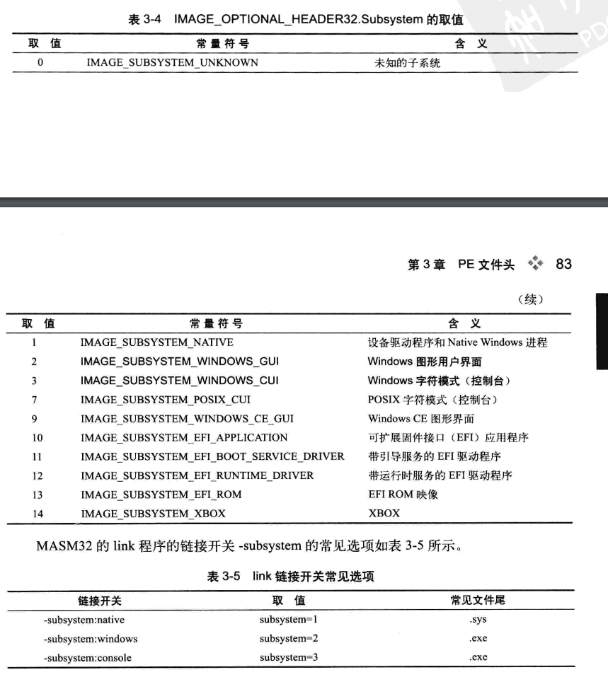

    - IMAGE_OPTIONAL_HEADER32.DllCharacteristics

        +005EH,单字。DLL文件属性。它是一个标志集，针对所有PE文件的。

        具体定义如下：
        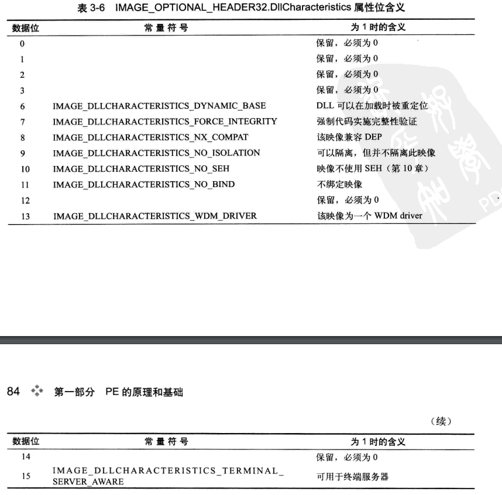

    - IMAGE_OPTIONAL_HEADER32.SizeOfStackReserve

        +0060H,双字。初始化时保留栈的大小。为初始线程的栈而保留的虚拟内存数量。并不是留出的所有虚拟内存都可以做栈。默认值是：0x100000（1MB）

    - IMAGE_OPTIONAL_HEADER32.SizeOfStackCommit

        +0064H,双字。初始化时实际提交的栈大小。保证初始线程的栈实际占用内存空间的大小。这些提交的栈不存在于交换文件里，而是在内存中。

    - IMAGE_OPTIONAL_HEADER32.SizeOfHeapReserve

        +0068H,双字。初始化时保留的堆大小。用来保留给初始进程堆使用的虚拟内存。默认为1MB

    - IMAGE_OPTIONAL_HEADER32.SizeOfHeapCommit

        +006CH,双字。初始化时实际提交的堆大小。在进程初始化时设定的堆所占用的内存空间。默认值为1页。

    - IMAGE_OPTIONAL_HEADER32.LoaderFlags

        +0070H，双字。加载标志。

    - IMAGE_OPTIONAL_HEADER32.NumberOfRvaAndSize

        +0074H，双字。定义数据目录结构的数量。一般为0000 0010H 即16个。该值由字段SizeOfOptionalHeaders决定，取值范围：2-16.

    - IMAGE_OPTIONAL_HEADER32.DataDirectory

        +0078H，结构。由16个IAMGE_DATA_DIRECTORY的结构线性排列而成。用于定义PE中的16种不同类别的数据所在的位置与大小。

        说明如下：

            [0]:导出数据所在的节：.edata 包含一些可被其他EXE程序访问的符号的相关信息：导出函数和资源等。通常出现在DLL中。某些EXE中也存在。
            [1]:导入数据所在的节：.idata 包含了PE映像中所有导入的符号。EXE和DLL中都存在。
            [2]:资源数据所在的节：.rsrc  多层的二叉排序树。树的节点指向PE中各种类型的资源：图标、对话框、菜单等。PE中常分3层：类型层，名称层，语言代码层。
            [3]:异常表数据所在的节：.pdata 用于异常处理的函数表项组成的数组。可选文件头中的ExceptionTable字段指向它。
            [4]:属性证书数据。类似PE文件的校验和或MD5.通过属性证书方式可以验证一个PE文件是否被非法修改过。每一个属性证书表项指向 WIN_CERTIFICATE 结构。
            [5]:基址重定位信息所在的节：.reloc 基址重定位表包含了映像中所有需要重定位的内容。他被划分为许多块。每一块表示一个4KB页面范围内的基址重定位信息。
            [6]:调试数据所处的节：.debug 指向 IMAGE_DEBUG_DIRECTORY 结构数组。其中的每个元素都描述了PE的调试信息。大部分情况下该字段被丢弃。
            [7]:预留，必须为0.
            [8]:Global Ptr 数据描述的是被存储在全局指针寄存器中的一个值
            [9]:线程本地存储数据所处的节：.tls  线程本地存储（TLS）是Windows支持的一种特殊存储类别。其中的数据对象不是栈变量，而是对应于运行相应代码的单个线程。每个线程都可以为使用TLS定义的变量来维护一个不同于其他线程的值。
            [10]:加载配置信息用于包含保留的SEH技术。基于x86的32位系统，提供了一个安全的结构化异常处理程序列表。
            [11]:绑定导入数据。优化导入信息，提高PE的加载效率。
            [12]:IAT（导入地址表），导入表的一部分。定义了所有导入函数的VA。
            [13]:延迟导入数据。为了给 应用程序直到首次调用某个DLL中的函数或数据时才加载这个DLL（延迟加载），提供了一种统一的访问机制。
            [14]:CLR数据所处的节：.cormeta .NET框架的一个重要组成部分。所有基于.NET框架开发的程序，其初始化部分都是通过访问这部分定义实现的。PE加载时通过该结构加载代码托管机制需要的所有动态链接库文件。并完成与CLR有关的一些其他操作。
            [15]:系统预留，未定义。

4. 数据目录项IMAGE_DATA_DIRECTORY的字段

    - IMAGE_DATA_DIRECTORY.VirtualAddress

        +0000H,双字。记录了特定类型数据的起始RVA，针对不同数据结构，该字段包含的数据含义不一样。属性证书数据该字段表示的是FOA

    - IMAGE_DATA_DIRECTORY.VirtualAddress

        +0004H,双字。记录了特定类型的数据块的长度。

5. 节表项IMAGE_SECTION_HEADER的字段

    - IMAGE_SECTION_HEADER.Name1

        +0000H,8字节。一般情况是以‘\0’结尾的ASCII字符串来标识节的名称。内存自行定义。

    - IMAGE_SECTION_HEADER.Misc

        +0008H,双字。union型数据。这是节的数据在没有对齐前的真实尺寸。不过很多PE中并不准确。

    - IMAGE_SECTION_HEADER.VirtualAddress

        +00CH，双字。节区的RVA地址。

    - IMAGE_SECTION_HEADER.SizeOfRawData

        +0010H,双字。节在文件中对齐后的尺寸。数据量不大的节，一般大小为200H

    - IMAGE_SECTION_HEADER.PointerToRawData

        +0014H，双字。节区起始数据在文件中的偏移。

    - IMAGE_SECTION_HEADER.PointerToRelocations

        +0018H，双字。在 .obj 文件中使用，指向重定位表的指针

    - IMAGE_SECTION_HEADER.PointerToLinenumbers

        +001CH，双字。行号表的位置。

    - IMAGE_SECTION_HEADER.NumberOfRelocations

        +0020H，单字。重定位表的个数（在OBJ文件中使用）

    - IMAGE_SECTION_HEADER.NumberOfLinenumbers

        +0022H，单字。行号表中行号的数量。

    - IMAGE_SECTION_HEADER.Characteristics

        +0024H，双字。节的属性。

        具体定义如下：
        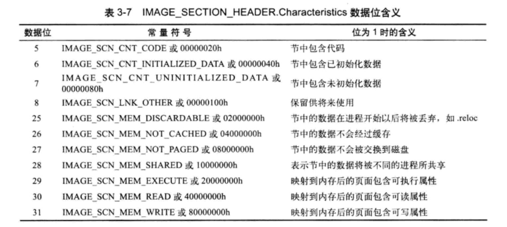

6. 解析HelloWorld程序的字节码

整理结构如图：

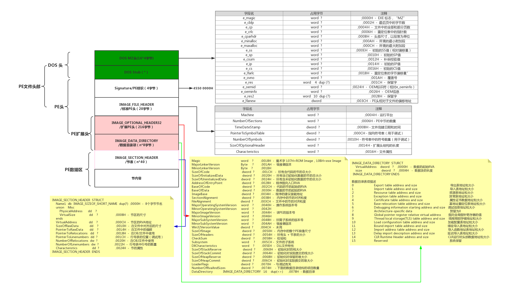

### 6、PE内存映像

### 7、PE文件头编程

1. RVA与FOA的转换

    RVA ： 在内存中的相对虚拟内存地址 （相对于IMAGE_OPTIONAL_HEADER32.ImageBase）
    FOA : 在文件中的偏移地址（相对IMAGE_NT_HEADER基址）

    RVA和FOA 都是偏移地址。

    前置条件：
        1.PE文件头 和 PE内存映像的文件头大小是一样的。它们受对齐粒度不同的影响。
        2. 节的数据在内存和磁盘文件的大小是一样的。
        3. 节表项 记录了 节 在内存中的起始RVA （IMAGE_SECTION_HEADER.VirtualAddress）
        4. 节表项 记录了 节在文件中的起始偏移(IMAGE_SECTION_HEADER.PointerToRawData)

    关键点：节在内存中是线性排列的！如果找到下一个节的内存起始RVA就能知道上一个节的大小。

    求给定的RVA 的FOA：

        1. 判断给定的RVA在哪个节内
        2. 求出该节的起始RVA0 = IMAGE_SECTION_HEADER.VirtualAddress
        3. 求出偏移量 offset = RVA - RVA0
        4. 求出该RVA相对于磁盘文件头的偏移：FOA = IMAGE_SECTION_HEADER.PointerRawData + offset

    .text :代码节
    .data : 数据节

2. 数据定位

    1. PE头定位
    2. 数据目录表项定位
    3. 节表项定位

3. 标志位操作
4. PE校验和

    校验和算法：

        1. 将文件头部的字段IMAGE_OPTIONAL_HEADER32.CheckSum 清0
        2. 以WORD 为单位堆数据块进行带进位的累加，大于WORD部分自动溢出
        3. 将累加和 加上文件的长度。

---

## 第四章 导入表

    数据目录中一共有4种类型的数据与导入表数据有关。

        1. 导入表
        2. 导入函数地址表
        3. 绑定导入表
        4. 延迟加载导入表

### 1、什么是导入表

    为了实现代码重用而设置的。
    通过分析导入表数据，可以获得诸如：PE文件的指令中调用了多少外来的函数，以及这些外来函数都存在于哪些动态链接库里等信息。

### 2、导入函数

1. invoke指令分解

        1. 压栈，将要调用的所有参数push 到栈中。先推入后参数，在推入前参数。null 为0
        2. 段内调用。通过指令call 调用一个段内地址
        3. 无条件转移。无条件跳转到某个内存位置。即导入函数在内存中的VA地址
        
2. 导入函数地址
3. 导入函数宿主

### 3、PE中的导入表

1. 导入表定位
2. 导入表描述符IMAGE_IMPORT_DESCRIPTOR
3. 导入表的双桥结构
4. 导入函数地址表
5. 构造调用同一个DLL文件的多个函数的导入表

### 4、导入表编程

1. 导入表遍历的思路
2. 编写函数 _getImportInfo
3. 运行测试

### 5、绑定导入

1. 绑定导入机制
2. 绑定导入数据定位
3. 绑定导入数据结构
4. 绑定导入实例分析

### 6、手工重组导入表

1. 常用注册表API
2. 构造目标指令
3. PE头部变化
4. 手工重组
5. 程序实现
6. 思考：关于IAT的连贯性
7. 思考：关于导入表的位置

---

## 第五章 导出表

### 1、导出表的作用

1. 分析动态链接库功能
2. 获得导出函数地址

### 2、构造含导出表的PE文件

1. DLL源代码
2. 编写def文件
3. 编译和链接
4. 编写头文件
5. 使用导出函数

### 3、导出表数据结构

1. 导出表定位
2. 导出目录IMAGE_EXPORT_DIRECTORY
3. 导出表实例分析

### 4、导出表编程

1. 根据编号查找函数地址
2. 根据名字查找函数地址
3. 遍历导出表

### 5、导出表的应用

1. 导出函数覆盖
2. 导出私有函数

---

## 第六章 栈与重定位表

### 1、栈

1. 栈的应用场合
2. call调用中的栈实例分析
3. 栈溢出

### 2、代码重定位

1. 重定位的提出
2. 实现重定位的方法
3. 重定位编程

### 3、PE文件中的重定位表

1. 重定位表定位
2. 重定位表项IMAGE_BASE_RELOCATION
3. 重定位表的结构
4. 遍历重定位表
5. 重定位表实例分析

---

## 第七章 资源表

### 1、资源分类

1. 位图、光标、图标资源
2. 菜单资源
3. 对话框资源
4. 自定义资源

### 2、PE资源表组织

1. 资源表的组织方式
2. 资源表数据定位
3. 资源目录头IMAGE_RESOURCE_DIRCTORY
4. 资源目录项IMAGE_RESOURCE_DIRCTORY_ENTRY
5. 资源数据项 IMAGE_RESOURCE_DATA_ENTRY
6. 三级结构中目录项的区别

### 3、资源表遍历

### 4、PE资源深度解析

1. 资源脚本
2. 使用PEInfo分析资源表
3. 菜单资源分析
4. 图标资源分析
5. 图标组资源分析
6. 对话框资源分析

### 5、资源表编程

1. 更改图标实验
2. 提取程序图标实例
3. 更改程序图标实例

---

## 第八章 延迟加载导入表

### 1、延迟加载导入的概念及其作用

1. 提高应用程序加载速度
2. 提高应用程序兼容性
3. 提高应用程序可整合性

### 2、PE中的延迟加载导入表

1. 延迟加载导入表数据定位
2. 延迟加载导入描述符 IMAGE_DELAY_IMPORT_DESCRIPTOR
3. 延迟加载导入表实例分析

### 3、延迟加载导入机制详解

### 4、延迟加载导入编程

1. 修改资源文件pe.rc
2. 修改源代码pe.asm

### 5、关于延迟加载导入的两个问题

1. 异常处理
2. DLL的卸载

---

## 第九章 线程局部存储

### 1、Windows进程与线程

1. Windows 体系结构
2. 进程与线程创建
3. 进程环境块PEB
4. 线程环境块TEB

### 2、什么是线程局部存储

### 3、动态线程局部存储

1. 动态TLS实例
2. 获取索引TlsAlloc
3. 按索引取值 TlsGetValue
4. 按索引存储TlsSetValue
5. 释放索引TlsFree

### 4、静态线程局部存储

1. TLS定位
2. TLS 目录结构 IMAGE_TLS_DIRECTORY
3. 静态TLS实例分析
4. TLS回调函数
5. 测试静态TLS下的线程存储初始化回调函数

---

## 第十章 加载配置信息

### 1、什么是加载配置信息

### 2、Windows结构化异常处理

1. 什么是SEH
2. Windows异常分类
3. 内核模式下的异常处理
4. 用户模式下的异常处理
5. Windows SEH机制解析
6. SEH编程实例

### 3、PE中的加载配置信息

1. 加载配置信息定位
2. 加载配置目录 IMAGE_LOAD_CONFIG_DIRECTORY
3. 加载配置信息实例分析

### 4、加载配置编程

1. 程序源代码分析
2. 为PE添加加载配置信息
3. 运行测试
4. 注册多个异常处理函数示例

---

## 第十一章 动态加载技术

### 1、Windows虚拟地址空间分配

1. 用户态低2GB空间分配
2. 核心态高2GB空间分配
3. HelloWorld进程空间分析

### 2、Windows动态库技术

1. DLL静态调用
2. DLL动态调用
3. 导出函数起始地址实例

### 3、在编程中使用动态加载技术

1. 获取kernel32.dll基地址
2. 获取GetProcAddress 地址
3. 在代码中使用获取的函数地址编程
4. 动态API技术编程实例

---

# 第二部分 PE进阶

## 第十二章 PE变形技术

### 1、变形技术的分类

1. 结构重叠技术
2. 空间调整技术
3. 数据转移技术
4. 数据压缩技术

### 2、变形技术可用的空间

1. 文件头部未用的字段
2. 大小不固定的数据块
3. 因对其产生的补足空间

### 3、PE文件变形原则

1. 关于数据目录表
2. 关于节表
3. 关于导入表
4. 关于程序数据
5. 关于对齐
6. 几个关注的字段

### 4、将PE变小的实例 HelloWorldPE

1. 源程序HelloWorld的字节码（2560字节）
2. 目标PE文件的字节码（432字节）

### 5、打造目标PE的步骤

1. 对文件头的处理
2. 对代码段的处理
3. 对导入表的处理
4. 对部分字段值的修正
5. 修改后的文件结构
6. 修改后的文件分析
7. 目标文件更小的实例分析

---

## 第十三章 PE补丁技术

### 1、动态补丁

1. 进程间的通信机制
2. 读写进程内存
3. 目标进程枚举
4. 执行远程线程

### 2、静态补丁

1. 整体替换PE文件
2. 整体替换DLL文件
3. 部分修改PE文件

### 3、嵌入补丁程序

1. 嵌入补丁程序框架
2. 嵌入补丁程序编写规则
3. 嵌入补丁字节码实例分析

### 4、万能补丁码

1. 原理
2. 源代码
3. 字节码
4. 运行测试

---

## 第十四章 在PE空闲空间中插入程序

### 1、什么是PE空闲空间

1. PE文件中的可用空间
2. 获取PE文件可用空间的代码
3. 获取PE文件可用空间的测试

### 2、添加注册表启动项的补丁程序实例

1. 补丁程序的源代码
2. 补丁程序的字节码
3. 目标PE的字节码

### 3、手工打造目标PE的步骤

1. 基本思路
2. 对代码段的处理
3. 对导入表的处理
4. 对数据段的处理
5. 修改前后PE文件对比

### 4、开发补丁工具

1. 编程思路
2. 数据结构分析
3. 运行测试
4. 适应性测试实例分析

---

## 第十五章 在PE间隙中插入程序

### 1、什么是PE间隙

1. 构造间隙一
2. 间隙一与参数

### 2、插入HelloWorld 的补丁程序实例

1. 补丁程序字节码
2. 目标PE结构

### 3、开发补丁工具

1. 编程思路
2. 数据结构分析
3. 主要代码
4. 运行测试

### 4、存在绑定导入数据的PE补丁程序实例

1. 改进补丁程序
2. 修正补丁工具
3. 为记事本程序打补丁

---

## 第十六章 在PE新增节中插入程序

### 1、新增PE节的方法

### 2、在本地建立子目录的补丁程序实例

1. 补丁程序源代码
2. 目标PE结构

### 3、 开发补丁工具

1. 编程思路
2. 为变量赋值
3. 构造新文件结构
4. 修正字段参数
5. 主要代码
6. 运行测试

---

## 第十七章 在PE最后一节中插入程序

### 1、网络文件下载器补丁程序实例

1. 用到的API函数
2. 补丁功能的预演代码
3. 补丁程序的源代码
4. 目标PE结构

### 2、开发补丁工具

1. 编程思路
2. 主要代码
3. 运行测试

---

#  第三部分  PE的应用案例

## 第十八章 EXE捆绑器

### 1、 基本思路

### 2、 EXE执行调度机制

1. 相关API函数
2. 控制进程同步运行实例分析

### 3、字节码转换工具 hex2db

1. hex2db源代码
2. 运行测试

### 4、执行调度程序 _host.exe

1. 主要代码
2. 数据结构分析

### 5、宿主程序host.exe

1. 宿主程序的功能
2. 宿主程序的状态
3. 遍历文件
4. 释放文件
5. 宿主程序主函数

### 6、EXE捆绑器 bind.exe

1. 绑定列表定位
2. 捆绑步骤及主要代码
3. 测试运行

---

## 第十九章 软件安装自动化

### 1、基本思路

### 2、补丁程序patch.exe

1. 相关API函数
2. 执行线程函数
3. 简单测试

### 3、消息发送器 _Message.exe

1. 窗口枚举回调函数
2. 调用窗口枚举函数
3. 向指定窗口发送消息
4. 消息发送器源代码
5. 测试运行

### 4、消息发送器生成工厂 MessageFactory.exe

1. 消息发送函数
2. 键盘虚拟码
3. 改进的消息发送器实例分析
4. 消息发送器生成工厂代码结构
5. 代码与数据的定位
6. 提取代码字节码

### 5、软件安装自动化主程序 AutoSetup.exe

1. 主要代码
2. 测试运行

---

## 第二十章 EXE枷锁器

### 1、  基本思路

### 2、免资源文件的窗口程序nores.asm

1. 窗口创建函数CreateWindowEx
2. 创建用户登录窗口的控件
3. 窗口程序源代码

### 3、免重定位的窗口程序login.asm

### 4、补丁程序patch.asm

1. 获取导入库及函数
2. 按照补丁框架修改login.asm
3. 补丁程序主要代码

### 5、附加补丁运行

---

## 第二十一章 EXE加密

### 1、   基本思路

### 2、加密算法

1. 加密算法的分类
2. 自定义可逆加密算法实例
3. 构造加密基表
4. 利用基表测试加密数据

### 3、  开发补丁工具

1. 转移数据目录
2. 传递程序参数
3. 加密节区内容

### 4、处理补丁程序

1. 还原数据目录表
2. 解密节区内容
3. 加载目标DLL
4. 修正目标IAT

---

## 第二十二章 PE病毒提示器

### 1、    基本思路

1. 志愿者的选择条件
2. 判断病毒感染的原理

### 2、手工打造PE病毒提示器

1. 编程思路
2. 分析目标文件的导入表
3. 补丁程序的源代码
4. 补丁程序的字节码
5. 修正函数地址
6. 测试运行

### 3、补丁版的PE病毒提示器

1. 将提示器写入启动项
2. 检测特定位置校验和
3. 测试运行

---

## 第二十三章 破解PE病毒

### 1、病毒保护技术

1. 花指令
2. 反跟踪技术
3. 反调试技术
4. 自修改技术
5. 注册表项保护技术
6. 进程保护技术

### 2、PE病毒补丁程序解析

1. 病毒特征
2. 补丁程序的源代码分析
3. 病毒传播测试
4. 感染前后PE结构对比

### 3、解毒代码的编写

1. 基本思路
2. 计算病毒代码大小
3. 获取原始入口地址
4. 修正PE头部的其他参数
5. 主要代码
6. 测试运行
