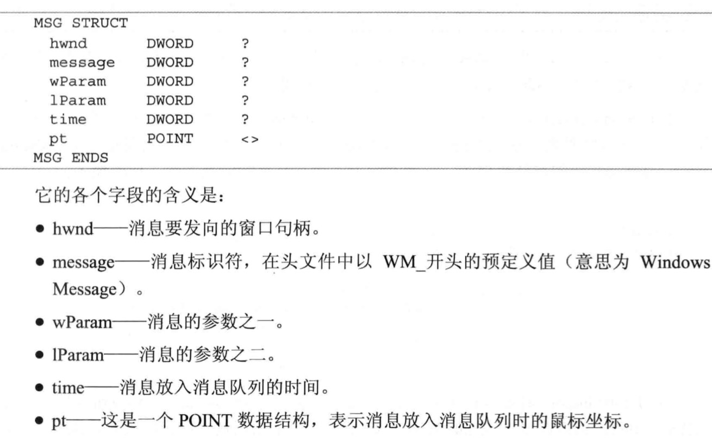

# 一、基础篇

## 第一章 背景知识

### 1.win32的软硬件平台

#### 1.1 80x86 系列处理器简史

#### 1.2 Windows 的历史

#### 1.3 Windows 平台的背后——Wintel联盟

### 2.Windows 的特色

### 3.必须了解的基础知识

#### 3.1 80x86处理器的工作模式

   > 80386有3种工作模式：实模式、保护模式和虚拟86模式

    实模式：
        1）实模式不支持优先级，可以执行所有特权指令
        2）不能对内存进行分页管理，所以指令寻址的地址就是内存种实际的物理地址。
        3） 加载CR0 修改保护模式位置位进入保护模式
        4） 实模式不支持硬件上的多任务切换

     保护模式：
        1） 保护模式是80386主要工作模式
        2） 支持内存分页机制，提供对虚拟内存的良好支持
        3） 支持优先级机制，不同程序运行在不同的优先级（0级-3级），操作系统在最高的0级，应用程序在比较低的级别。
        4）Dos运行在实模式下，Windows运行在保护模式下。
        5）实模式切换到保护模式过程：修改控制寄存器CR0的控制位PE（位0）实现。修改前需要建立保护模式必须的数据表。如全局描述符表GDT和中断描述符表IDT等。

     虚拟86模式
        1） 虚拟86模式是为了在保护模式下执行8086程序而设置的。
        2）此模式下80386支持任务切换和内存分页
        3) Windows操作系统中，有一部分程序专门用来管理虚拟86模式的任务，称为虚拟86管理程序
        4）实际上是实模式和保护模式的混合。

   > 实模式和虚拟86模式是为了兼容8086处理器

#### 3.2 Windows 的内存管理

  > DOS系统的内存安排，如下图

   

  > 实模式的寻址方式

   

  > 80386的内存寻址机制

    80386中任何一个通用寄存器都可以间接寻址，不需要分段就可以访问到所有内存地址。

    段寄存器(16位)用来存储地址空间定义上的属性 和 保护模式下段的其他参数等信息。（要用64位长的数据才能表示）

    这64位长的属性数据叫做段描述符（Segment Descriptor）

    段描述符表（Descriptor Table）：所有段的段描述符顺序放在内存中的指定位置，组成了段描述符表

    段选择器（Segment Selector）：段寄存器中的16位用来做索引信息，指定这个段的属性用段描述符表中的 第几个描述符来表示。

    可以通过段选择器在段描述符表中选择一个项目以得到段的全部信息。

    段描述符表寄存器 ：
        1） GDTR（Global Descriptor Table） ： 48位的全局描述符表寄存器，包含系统中所有任务都可用的段描述符。通常包括描述操作系统所使用的代码段、数据段、和堆栈段的描述符及各任务的LDT段等。仅有1个。
        2）LDTR（Local Descriptor Table）： 16位的局部描述符表寄存器。80386中每个任务都有一个独立的LDT。它包含每个任务私有的代码段、数据段和堆栈段的描述符。也包含该任务所使用的门描述符，如任务门和调用门描述符等。

    不同任务的局部描述符表分别组成不同的内存段，描述这些内存段的描述符当作系统描述符放在全局描述符表中。

    GDTR 直接指向内存地址。
    LDTR和CS，DS等段选择器只存放索引值，指向局部描述符表内存段对应的描述符在全局描述符表中的位置。随着任务的切换，只要改变LDTR的值，系统当前的局部描述符表LDT也随之切换。这样便于各任务之间数据的隔离。

    16位的段选择器只有高13位表示索引值，剩下的3个数据位： 0，1 表示程序当前的优先级RPL。第2位 TI位表示在段描述符的位置：TI=0 在GDT中 TI = 1 在LDT中。

> 80386 的内存分页机制

      线性地址 ： 保护模式下通常转换后的地址为线性地址而非物理地址

      内存分页，可以避免内存被分割成无数个碎片，从而无法使用，浪费内存空间。

      80386 把4KB大小的一块内存当作 一 页。每页物理内存可以根据 页目录和页表，随意映射到不同的线性地址。从而将不连续的物理地址 和内存的映射连到一起。在线性地址上视为连续。

      80386处理器中，除了和CR3寄存器（指定当前页目录的地址）相关的指令使用的是物理地址外，其他所有指令都是用线性地址寻址。

      是否启用内存分页机制由80386处理器新增的 CR0 寄存器中的位 31 （PG位）决定。
      PG = 0：不启用分页。
      PG = 1：启用分页

      只有在保护模式下才可以实现内存分页管理。实模式不支持分页机制。

      页表规定的不仅是地址的映射，同时还规定了页的访问属性。如是否可写，可读和可执行等。

   

   > Windows 的内存安排

      Windows系统一般在硬盘上建立大小为物理内存两倍左右的交换文件用作虚拟内存
      Windows 9x: Win386.swp
      Windows NT : PageFile.sys

      Windows操作系统通过切换不同的页表内容让线性地址在不同的时间片中映射不同的内容。

      几个重要的概念：
         1） 每个应用程序都有自己的4GB寻址空间，该空间可存放操作系统、系统DLL和用户DLL的代码。他们之中有各种函数供应用程序调用。在出去其他的一些空间，余下的是应用程序的代码、数据和可以分配的地址空间
         2） 不同应用程序的线性地址空间是隔离的。虽然他们在物理内存中同时存在，但在某个程序所属的时间片中，其他应用程序的代码和数据没有被映射到可寻址的线性地址中，所以是不可访问的。从编程的角度看，程序可以使用4GB寻址空间，而且这个空间是私有的。
         3） DLL程序没有自己私有的空间，他们总是被映射到其他应用程序的地址空间中，当作其他应用程序的一部分运行。原因很简单，如果他不和其他程序同属一个地址空间，应用程序该如何调用？

   > 从Win32 汇编的角度看内存寻址

      Windows 操作系统为用户程序安排好了一切。程序员在编程中不用关心段寄存器（不可修改，系统自己完成）

#### 3.3 Windows 的特权保护

   > 80836的中断和异常

      在保护模式下，中断或异常处理往往从用户代码切换到操作系统代码中执行。

      优先级低的应用程序----》 优先级高的系统代码

      门的概念：
         门 指向某个优先级高的程序所规定的入口点。所有优先级低的程序调用优先级高的程序只能通过门重定向，进入门所规定的入口点。避免了低级别代码从任意位置进入优先级高的程序的问题。
         保护模式下的中断和异常等服务程序也要从门进入。
         80386的门分为：中断门、自陷门、和任务门几种。

      中断描述符：需要8个字节，表示一个中断或异常服务程序的信息。
      IDT（Interrupt Descriptor Table）： 中断描述符表，所有的中断描述符组成
      IDTR：48位中断描述符表寄存器。高32位指定IDT在内存中的基址（线性地址），低16位指定IDT的长度。
      中断过程：处理器先根据IDTR寄存器得到中断描述符的地址----》 取出n号中断/异常的门描述符-----》从描述符中得到中断服务程序的地址 ------》经过段地址转换得到服务程序的32位线性地址并转移后执行

      用户程序没有权限写入中断描述符表！！！
      Windows 采用动态链接库来代替中断服务程序提供系统功能。

   > 80386的保护机制

     1） 段的类型检查。段类型检查不通过，处理器会产生一般性保护异常或堆栈异常
     2） 页的类型检查。1、2、3优先级代码，还要根据页表中的R/W项决定是否可写。越权会产生页异常
     3）访问数据时的级别检查。优先级低的代码不能访问优先级高的数据段。
     段描述符中有DPL域（描述符优先级），表示这个段可以被访问的最低优先级。
     RPL域（请求优先级），表示当前执行代码的优先级。
     DPL在数值上大于或等于RPL的时候，该段才可以被访问（注意，数值上大于！而不是优先）。否则会产生一般性保护异常。
     4） 控制转移的检查。检查跳转指令jmp、call、ret、iret等指令是否是从低优先级跳转到高优先级。
     5）指令集的检查。有两类指令可以影响保护机制。
     第一类：改变GDT、LDT、IDT以及控制寄存器等关键寄存器的指令，称为特权指令。
     第二类：操作I/O端口的指令以及cli和sti等改变中断允许的指令，称为敏感指令。
     特权指令只能在优先级为0时运行。
     敏感指令取决于eflags寄存器中的IOPL位。只有IOPL位表示的优先级高于当前代码段的优先级时，指令才能执行。
     6）I/O操作的保护。通过I/O可以绕过系统对硬件进行控制。
     80386单独为I/O空间提供保护，每个任务有个TSS（任务状态段）来记录任务切换的信息。
     TSS中有个I/O允许位图，用来表示对应的I/O端口是否可以操作。位图中对应数据位为 0 ，则表示不可操作。
     如果为1还要看eflags中IOPL位，只有IOPL位表示的优先级高于等于当前代码段的优先级，才允许访问该I/O端口。

   > Windows 的保护机制

      在Windows下，操作系统运行于0级。 应用程序运行于3级。
      注意事项：
         1）所有特权指令都是不可执行的
         2）Windows在页表中把代码段和数据段中的内存页赋予不同的属性，代码段是不可写的。数据段中只有变量部分页面是可写的。虽然寻址为4GB空间，但访问超出权限规定以外的内存会引发保护异常。
         3） windows 98 中系统硬件的IO端口是受保护的。可以操作用户自己外接设备。在Windows NT中，任何的端口操作，都不被允许。
---
<br>

## 第二章 准备编程环境

### 1.Win32可执行文件的开发过程

      Win32可执行文件叫做PE文件。
      PE文件的基本结构和DOS可执行文件有很大的不同，他把程序中不同部分分成各种节区（Section）,其中可以有一个节区是放置各种资源的。如菜单、对话框、位图、光标等。所在在Win32的开发中 多了一个创建资源文件的步骤。

### 2 编译器和链接器

#### 2.1 MASM系列

         微软公司推出的汇编编译器
         上下兼容性不好

#### 2.2 TASM系列

         Borland公司推出的汇编编译器。

#### 2.3 其他编译器

#### 2.4 MASM，TASM还是NASM

         NASM有点，学到的语法可以直接用在Linux 的汇编中。缺点是免费软件缺乏后盾。

#### 2.5 我们的选择——MASM32 SDK软件包

### 3.创建资源

#### 3.1资源编译器的使用

#### 3.2所见即所得的资源编辑器

### 4.make工具的用法

#### 4.1 make工具是什么

         make 工具可以看成智能的批处理工具。通过调用makefile文件中用户指定的命令来进行编译和链接。
         make工具可根据目标文件上一次编译的时间和所依赖的源文件的更新时间自动判断应当编译哪些源文件。没更新的文件不会处理。

#### 4.2 nmake的用法

#### 4.3 描述文件的语法

         1.注释和换行
         2.宏定义
         3.显式规则
         4.隐式规则

### 5.获取资料

#### 5.1 Windows资料的来源

#### 5.2 Intel处理器资料

### 6.构建编程环境

#### 6.1 IDE还是命令行

#### 6.2 本书推荐的工作环境

         1.安装软件：编辑软件Editplus、MSDN、十六进制编辑器Hexedit、可视化资源编辑器Resource Workshop、调试工具Soft-ICE和反汇编软件W32DASM。
         2.安装MASM32 SDK软件包。bin，include，lib三个最重要的目录。
         3.建立源文件目录。
         4.安装nmake拷贝到bin
         5.设置环境变量：include，如有VC++，Include和MFC\Include目录包含进去；lib；bin

#### 6.3 尝试编译第一个程序

---

<br>

## 第三章 使用MASM

### 1.Win32汇编源程序的结构

#### 1.1 模式定义

#### 1.2 段的定义

#### 1.3 程序结束和程序入口

#### 1.4 注释和换行

### 2.调用API

#### 2.1 API是什么

         Win32的系统功能模块放在Windows 的动态链接库（DLL）中。
         DLL是一种Windows 的可执行文件，采用和.exe 同样的PE格式。
         在PE格式文件头的导出表中，以字符串形式指出这个DLL能提供的函数列表。应用程序使用字符串类型的函数名指定要调用的函数。
         应用程序在使用的时候由Windows 自动装入DLL程序并调用相应的函数

   > Win32 的基础就是由DLL组成,Win32 API 的核心由3个DLL提供

         1）KERNEL32.DLL：系统服务功能。包括内存管理、任务管理和动态链接等。
         2）GDI32.DLL：图形设备接口。利用VGA与DRV之类的显示设备驱动程序完成显示文本和矩形等功能。
         3）USER32.DLL：用户接口服务。建立窗口和传送消息等。

#### 2.2 调用API

   > Win32 API 是用堆栈来传递参数的。

      调用者把参数一个个压入栈中。DLL中的函数程序再从堆栈中取出参数处理，并在返回之前将栈中无用的参数释放。

   > int MessageBox(HWND hWnd,LPCTSTR lpText,LPCTSTR lpCaption,UINT uType)调用实例

   ```
      push  uType
      push  lpCaption
      push  lpText
      push  hWnd
      call  Messagebox
   ```

      上述代码，在源程序编译链接成可执行文件后，call MessageBox 语句中的MessageBox 会被换成一个地址，指向可执行文件中的导入表。导入表中指向MessageBox函数的实际地址会在程序装入内存的时候，根据User32.dll 在内存中的位置由Windows系统动态填入。

   > invoke 语句

      invoke   函数名[,参数1][,参数2]......

   > API 函数的返回值

      返回值永远放在eax中，如果eax放不下，则eax返回一个指向返回数据的指针。
      或者调用函数时提供缓冲区地址，数据返回到缓冲区中。

   > 函数的声明

      声明函数的格式 ： 函数名 proto [距离][语言][参数1]:数据类型,[参数1]:数据类型,...
      proto 函数声明伪指令。
      距离：NEAR，FAR，NEAR16，NEAR32，FAR16，FAR32.通常可忽略。
      语言类型：同.model 的语言类型，如果忽略，使用.model定义的默认值
      参数名称仅为可读性提供，并无意义。
      win32 API 仅仅使用dword 类型的参数，所以大多数数据类型都是dword

      win32中处理字符串的API 有两类，对应两个字符集：ANSI字符集，Unicode 字符集
      ANSI 函数以A结尾
      Unicode 函数以W结尾

   > include 语句

      格式 ：include 文件名 或  include <文件名>
      所有要用到的API函数都需要在程序开始部分预先声明。
      为了简化操作，所有的声明都预先放在了一个文件中。用include 语句包含进来。
      当文件名可能产生同名或混淆时，用<> 。

   > includelib 语句

      格式： includelib 库文件名 或 includelib <库文件名>
      用法同include

#### 2.3 API参数中的等值定义

### 3.标号、变量和数据结构

   > 标号和变量的命名规范

   - 可以用字母、数字、下划线及符号@、$和？

   -  第一个符号不能是数字
   -  长度不能超过240个字符
   -  不能使用指令名等关键字
   -  在作用域内必须唯一
####  3.1 标号
   > 定义

      格式：
      标号名:    目的指令    ;方法1
      标号名::    目的指令    ;方法2
      方法1的作用域是当前子程序，单个子程序标号不能重复
      方法2 用来跳转到另一个子程序中。作用域是整个程序。对其他子程序可见。

   > MASM中的@@

      当用@@做标号时，可以使用@F 和@B来引用它。
      @F：本条指令后的第一个@@标号
      @B：本条指令前的第一个@@标号
      注：程序中可以有多个@@标号，但@B和@F只去匹配最近的一个

#### 3.2 全局变量

   > 定义

      格式：变量名      类型     初始值1，初始值2，...
      作用域是整个程序。
      定义在 .data / .data? 中

   > 全局变量的初始化值

      初始化值为0

#### 3.3 局部变量

   > 局部变量的定义

      格式：local    变量名1[[重复数量]][:类型]，变量名1[[重复数量]][:类型],...
      local伪指令必须紧接在子程序定义的伪指令 proc 后，其他指令前。
      局部变量不能和全局变量同名，作用域为当前子程序。
      例: local      loc1[1024]:byte
          local      loc2
          local      loc3:WNDCLASS
      不定义数据类型，则默认为dword类型

   > 局部变量的初始化值

      局部变量无法在定义的时候指定初始化值的。
      它开始的值是其他程序执行后在堆栈中留下的垃圾。
      所以，局部变量的值一定要初始化，特别是定义结构后当参数传递给API的时候

#### 3.4 数据结构

   > 具体用法，如下图所示

   )

#### 3.5 变量的使用

   > movzx 和 dword ptr 指令

      mov eax,dword ptr word_address 这里不会进行汇编的语法检查，因此会得到意料之外的结果
      如果想要 余下的高位 自动补0，可以使用 movzx指令
      movzx 操作数A,操作数B
      操作数A的空间 必须大于等于操作数B的空间
      将操作数B扩展到同A一样大的空间，自动填充其他缺省位为0

   > sizeof 和 lengthof

      sizeof : 取得变量、数据类型或数据结构以字节为单位的长度
      lengthof：取得变量中数据的项数

   > 取变量地址
   -  offset 方法
   - lea 指令
   - addr 伪指令

         取局部变量地址时，只能用于invoke参数
         当addr 后面跟局部变量名时，编译器自动用lea指令把地址取到eax，然后用eax来代替变量地址
         因此，当invoke 传参数时，eax寄存器不能用于 addr 前面

### 4.使用子程序

#### 4.1 子程序的定义

      格式：
      proc [距离][语言类型][可视区域][USES寄存器列表][,参数：类型]...[VARARG]
      local  局部变量列表

         指令
      子程序名    endp

      子程序属性：
      距离：可以忽略
      语言类型：表示参数的使用方式和堆栈平衡的方式，有StdCall,C,SysCall,BASIC,FORTRAN,PASCAL 如果忽略，则使用程序头部.model定义
      可视区域：PIRVATE、PUBLIC、EXPORT。private只对本模块可见；public对所有模块可见（在最后的.exe文件中）;export 导出的函数，编写DLL时，导出某个函数可以这么用。默认PUBLIC
      USES寄存器列表：编译器在子程序指令开始前自动安排push 这些寄存器的指令，并在ret前自动pop，用于保存执行环境。
      参数和类型：参数指参数的名称。参数类型可以省略。默认dword。参数定义的最后如果跟VARARG 表示在已确定的参数后还可以跟多个数量不确定的参数。

#### 4.2 参数传递和堆栈平衡

   

### 5.高级语法

#### 5.1条件测试语句
   > 格式

      寄存器或变量   操作符   操作数
      两个或两个以上可以用逻辑运算符 连接

   > 标志寄存器

   

#### 5.2 分支语句

   

#### 5.3 循环语句

   

   > .repeat/.untilcxz 指令会使编译器强制使用loop来完成循环

### 6.代码风格

#### 6.1 变量和函数的命名

   > 常用前缀

   

#### 6.2 代码的书写格式

#### 6.3 代码的组织

---

<br>
<br>


# 初级篇

## 第四章 第一个窗口程序

### 1.开始了解窗口

#### 1.1 窗口是什么

#### 1.2 窗口界面

   - 窗口边框
   - 标题栏
   - 菜单
   - 工具栏
   - 图标 和 最小化、最大化、关闭按钮
   - 状态栏
   - 客户区
   - 滚动条

所示如下图
   

#### 1.3 窗口程序是怎么工作的


### 2.分析窗口程序

   > 窗口程序是事件驱动的！

#### 2.1 模块和句柄

   - 模块的概念

         一个模块代表的是一个运行中的EXE文件或DLL文件，用来代表这个文件中所有的代码和资源，磁盘上的文件不是模块，只有被载入内存后运行时才是模块。
         一个应用程序调用其他DLL中的API时，这些DLL文件被装入内存，就产生了不同的模块。为了区分地址空间中的不同模块，每个模块都有一个唯一的模块句柄来标识。

         由于很多API函数中都要用到程序的模块句柄，以便利用程序中的各种资源。因此程序的一开始通常就取得模块句柄并存放到全局变量中。

         Win32中模块句柄在数值上等于程序在内存中装入的起始地址！

         ps：模块就是装入内存后运行的dll文件或exe 文件中的所有代码和资源。
         每个模块都有一个句柄，为了方便别的函数调用！
   - 获取模块句柄

         invoke GetModuleHandle,lpModuleName
         lpModuleName:一个指向含有模块名称字符串的指针，如果为null，则得到调用者本模块的句柄。
         可以使用GetModuleHandle函数取得程序地址空间中各个模块的句柄！

         ps：hInstance 就是 hModule

   示例代码：
   ```
      szUserDll   db    'User32.dll',0
      ...
      invoke   GetModuleHandle,addr szUserDll
      .if      eax
               mov      hUserDllHandle,eax
      .endif
      ...
   ```
   - 句柄（Handle）是什么

         句柄只是一个数值，这个值是Windows 用来表示各种资源的编号，只有Windows 才知道怎么使用它来引用各种资源。

#### 2.2 创建窗口

   - 注册窗口类

         建立窗口类的函数是在系统中注册。
         API为：RegisterClassEx，
         Ex为扩展的意思。
         窗口的属性都定义在WNDCLASSEX结构中。
         WNDCLASSEX 是 WNDCLASS 的扩展。
   WNDCLASSEX结构如下图：
   

   - 建立窗口

####  2.3 消息循环

   - 消息循环中的MSG结构（用于消息传递）
   
   - 其他形式的消息循环

   代码如下：
   ```
      .while   TRUE
               invoke      PeekMessage,addr @stMsg,NULL,0,0,PM_REMOVE
               .if         eax
                           .break      .if   @stMsg.message == WM_QUIT
                           invoke      TranslateMessage,addr @stMsg
                           invoke      DispatchMessage,addr @stMsg
               .else
                           <do other things>
               .endif
      .endw
   ```
         PeekMessage : 当消息队列有消息时，PeekMessage取回消息，并在eax中返回非0值，没有消息直接返回，并在eax中返回0.
         因此在返回非0时只要检查消息是否是WM_QUIT 是则结束消息循环，不是则处理并转发消息。
         返回0时，程序可以继续做其他的事情！
         参数PM_REMOVE 取回消息时删除消息队列中的消息，PM_NOREMOVE 不删除。此时每次没看到的都是第一条消息

#### 2.4 窗口过程

   窗口过程即消息响应的回调函数！供windows 调用
   - 窗口过程的结构

   - 收到消息的顺序

         窗口过程收到消息是有顺序的。
         收到第一条消息，并不是从消息循环开始以后！
         在CreateWindowEx中就开始了。显示和刷新窗口的函数ShowWindow 和UpdateWindow也向窗口过程发送消息。

         WM_CREATE:防止窗口初始化代码，如建立各种子窗口（状态栏和工具栏等）
         WM_SUZE：放置位置安排的代码，因为建立的子窗口可能需要随窗口大小的改变而移动位置
         WM_PAINR:如果需要自己绘制客户区，在这里安排代码
         WM_CLOSE:向用户确认是否退出，如果退出则摧毁窗口并发送WM_QUIT 消息
         WM_DESTROY:窗口摧毁，这里放置释放资源等扫尾代码

   - 消息的默认处理：DefWindowProc

         DefWindowProc：用于默认处理消息。窗口过程会收到许多消息，许多都是大同小异。
         窗口过程只需要处理个性化的消息。对于表现行为是默认行为的消息，则用DefWindowProc处理
   DefWindowProc 默认处理方式
   大部分消息都不需要处理，交给DefWindowProc即可
   

   PS：WM_CLOSE 用户有关闭窗口的意向，但窗口过程可以不服从。但收到WM_DESTROY的时候窗口已经在关闭过程中了。
   这两个消息，窗口必须处理其中一个，因为必须有个地方发送WM_QUIT消息来结束消息循环

### 3.窗口间的通信

#### 3.1 窗口间的消息互发

   - SendMessage

         invoke   PostMessage,hWnd,Msg,wParam,lParam

   - PostMessage

         invoke   sendMessage,hWnd,Msg,wParam,lParam

   对于不同的Msg，wParam和lParam的含义是不同的！

   - SendMessage 的过程

         如果程序1 用于SendMessage 调用程序2所属窗口的窗口过程。但程序2窗口过程的代码并不在程序1的地址空间中。
         那么在程序1调用SendMessage函数的时候，Windows 会现保存wParam和lParan参数并等待。等轮到程序2的时间片的时候再去调用它的窗口过程。并把保存的wParam和lParam参数发给它。等窗口过程返回的时候Windows记下返回值并等待。在等轮到程序1的时间片的时候把返回值当做SendMessage的返回值给程序1，这样程序1看上去就像自己直接在调用程序2的窗口过程了。

         当参数是指针时，Windows会对指针指向的内容进行处理，以便数据能够正常传递！
         Windows首先创建一块共享内存，并将参数指向的内存中的内容复制到该内存中，然后在发送消息到其他进程。并将共享内存在目标进程中的地址发送给目标窗口过程。
         当目标窗口过程处理完成，函数返回，共享内存被释放。

#### 3.2 在窗口间传递数据

   - WM_COPYDATA

         用于在不同进程的窗口间自由拷贝任意类型的数据！这里用COPYDATASTRUCT结构来描述要拷贝的数据的长度和位置
         COPYDATASTRUCT    STRUCT
            dwData   DWORD    ?        ;附加字段
            cdData   DWORD    ?        ;数据长度
            lpData   DWORD    ?        ;数据位置指针

#### 3.3 SendMessage 和 PostMessage 函数的区别

      从逻辑上看，SendMessage函数相当于直接调用其他窗口的窗口过程来处理某个消息，并等待窗口过程的返回，在函数返回后，目标窗口过程必定已经处理了该消息。
      PostMessage 函数则将消息放入目标窗口的消息队列中后直接返回，函数返回后，目标窗口是否处理消息，未知。该函数不能用于任何参数中用到指针的消息。

---
<br>

## 第五章 使用资源

   > windows 资源
   - 菜单和加速键
   - 光标和图标
   - 对话框
   - 字符串资源
   - 版本信息
   - 自定义资源

### 1. 菜单和加速键

#### 1.1 菜单和加速键的组成

   - 加速键
         加速键就是菜单项的快捷键
         Windows默认加速键：
         F10 打开窗口的主菜单
         Alt+ space 打开系统菜单
         Alt + F4 单击关闭按钮

#### 1.2 菜单的加速键的资源定义

   1. 菜单的定义
         菜单项目的定义方法有3种
         1. MENUITEM 菜单文字，命令ID [,选项列表]
         2. MENUITEM SEPARATOR
         3. POPUP 菜单文字 [,选项列表]
            BEGIN
                  item-definitions
                  ...
            END
         1 定义的是普通菜单
         2 定义的是菜单项之间的分割线
         3 定义的是弹出式菜单，顶层菜单是由多个弹出式子菜单组成的。
      - 菜单文字
            显示在菜单项种的字符串如果需要字符串中某个字母带下划线，那么可以在字母前面加&符号。
            如“菜单（F）” 就要写成 “菜单（&F）”，带下划线的字母可以被系统自动当成快捷键。
            如果要显示 “Alt + F”字符，可以在两者之间加\t 表示插入一个Tab字符
            写为“菜单（&F）...\tAlt+F”,Tab后面的字符在显示的时候会由对齐。
      - 命令ID
            用来分辨不同的菜单项，当菜单被选中的时候，Windows会向窗口过程发送WM_COMMAND消息，消息的参数就是命令ID，用命令ID可以分辨用户究竟选中了哪个菜单项。
      - 选项
            用来定义菜单项的各种属性，它可是下列数值：
            CHECKED ： 打上选定标志（对勾）
            GRAYED ： 表示菜单项是灰化的
            INACTIVE：菜单项是禁用的
            MENUBREAK或MENUBARBREAK：将这个菜单项和以后的菜单项列到新的列中
   2. 加速键的定义
         定义：
         加速键ID    ACCELERATORS
         BEGIN
            键名，命令ID [,类型] [,选项]
            ...
         END
      - 键名 
            表示加速键对应的按键。3种方式定义
            "^字母"：表示Ctrl + 字母
            “字母”：表示字母，这时类型必须指明是VIRTKEY
            “数值”：表示ASCII码为该数值的字母，这时类型必须指明为ASCII
      - 命令ID
            按下加速键后，Windows向程序发送的命令ID。如果想把加速键和菜单项关联起来，这里就是要关联菜单项的命令ID
      - 类型
            用来指定键的定义方式，可以是VIRtkEY和ASCII，分别用来表示“键名” 字段一定的是虚拟键还是ASCII码
      - 选项
            可以是Alt，Control或Shift中的单个或多个，如果指定多个，则中间用逗号隔开，表示加速键是按键加上这些控制键的组合键。
      - 原则
            同类别的多个资源，资源ID必须为不同的值
            不同类别的资源，资源ID在数值上可以是相同的。
####  1.3 使用菜单和加速键
            写为“菜单（&F）...\tAlt+F”

#### 1.3 使用菜单和加速键

   - 加载菜单

      加载菜单两种方式
      1：注册窗口类的时候指定类的默认菜单
      2：建立窗口的时候在参数中指定菜单句柄

   - 加载加速键

      加速键 核心代码：TranslateAccelarator
      Windows 检查加速键资源，看按键是否符合某个加速键，如果符合则向目标窗口发送：WM_COMMAND 或 WM_SYSCOMMAND 消息，并返回true。
      如果不符合则不进行任何处理并返回FALSE
   - 菜单和加速键消息

      当用户选择菜单时，Windows 向菜单所属窗口发送 ： WM_COMMAND 消息。
      当用户按下一个加速键时，Windows 向TranslateAccelerator函数指定的目标窗口发送WM_COMMAND消息

   - 菜单项的修改
   

   - 使用系统菜单

      系统菜单：按下了标题栏图标后弹出的菜单。
      选择系统菜单的菜单项后，Windows向窗口发送的是WM_SYSCOMMAND消息而非WM_COMMAND.
      默认的系统菜单中已经有还原(SC_RESTORE)，移动(SC_MOVE) ，大小(SC_SIZE)，最大化(SC_MAXIMIZE)，最小化(SC_MINIMIZE)和关闭(SC_CLOSE)等菜单项。一般不进行处理。交给DefWindowProc处理

   - 右键弹出菜单

      用户在客户区按下鼠标右键，弹出一个菜单。这个功能是用TrackPopupMenu实现的。
      invoke   TrackPopupMenu,hMenu,uFlags,x,y,nReserved,hWnd,lpRect
      执行后在参数指定的x，y 位置弹出一个属于hWnd 窗口的菜单。菜单句柄是hMenu .
      函数中的坐标是以整个屏幕左上角为基准的！

   - 菜单状态的检测和设置

      对菜单项状态的检测可以用GetMenuState函数来完成。
      invoke   GetMenuState,hMenu,uId,uFlags
      hMenu 菜单的句柄
      uId 定位要检测的菜单项
      返回-1 为失败

   - 其他菜单函数

      图标和静态光标的文件扩展名为别是：ico和cur
      ani：动态光标文件

### 2.图标和光标

#### 2.1 图标和光标的资源定义

#### 2.2 使用图标和光标

### 3.位图

#### 3.1 位图简介

   位图（Bitmap） 是Windows 操作系统存储图像的方式。图像中的每个像素对应存储器中的一个或多个数据位。
   单色位图每个像素对应1位
   16色位图每个像素对应4位。
   256色为8位
   全彩色为24位

   - 位图的优点

      操作的速度很快。

   - 缺点

      尺寸问题，占用空间大
      缩放问题。位图缩放后要对原来的像素数据进行插值计算，不可避免会失真。

   - 使用前必须清楚几个概念：位图、设备无关位图和位图文件

#### 3.2 在资源中定义位图

### 4. 对话框

#### 4.1 对话框简介

   - 对话框的类型

      对话框分两类：model 对话框 和modeless对话框。即模态的和非模态的！
      当显示非模态对话框时，用户可以随意在这个对话框和其他窗口之间切换。
      当显示模态对话框时，用户在关闭对话框之前不允许切换到同一程序的其他窗口中，但可以切换到其他程序的窗口中。
      如果显示的是操作系统所属的模态对话框（系统模态） 则切换到其他任何程序的窗口都是不允许的。


   - 对话框的工作原理

      DialogBoxParam : 建立模态对话框
      CreateDialogParam : 建立非模态对话框
      这两个函数都不需要创建对话框的窗口类
      Windows在这两个函数的内部调用CreateWindowEx来建立对话框。

      模态对话框：Windows会在其内部建立一个消息循环。在这个消息循环中把消息发送给对话框管理器，对话框管理器在处理消息的过程中会调用用户定义的对话框过程。对话框关闭，Windows退出内建的消息循环。并从DialogBoxParam函数返回。
      非模态对话框：CreateDialogParam 函数在创建对话框后直接返回，对话框窗口的消息是通过用户程序中的消息循环派送的。

   > 模态对话框的特性，可以很方便的用来做小程序的主窗口

#### 4.2 对话框的资源定义

   - 对话框资源定义的语法

         对话框ID    DIALOG   [DISCARDABLE]     x坐标，y坐标，宽度，高度
         [可选属性]
         BEGIN
               子窗口控件
               ...
         END
   - 对话框的可选属性
   

   - Tab 停留位和组

      Tab停留位：用户可以使用Tab键将输入焦点切换到下一个有WS_TABSTOP风格的子窗口控件上，也可以用shift + Tab 键切换到上一个，Tab键切换的顺序就叫Tab停留位。
      Tab 停留位不是按照子窗口控件的坐标位置自动排列的，而是按照子窗口空间在资源脚本文件中的定义顺序来排列的。

#### 4.3 使用对话框

   - 创建模态对话框

         格式：
         invoke      DialogBoxParam,hInstance,lpTemplateName,hWndParent,lpDialogFunc,dwInitParam

         hInstance 和 lpTemplateName ：函数从hInstance 参数指定的模块中装入lpTemplateName 参数指定的对话框资源，然后显示对话框窗口。
         hWndParent：对话框的父窗口，对话框关闭之前将无法切换到父窗口所属的其他窗口中。
         lpDialogFunc : 指定了对话框过程的地址。
         dwInitParam:当作 WM_INITDIALOG 消息的lParam 传给对话框过程。

      要结束对话框，必须在对话框过程的WM_CLOSE 消息中使用 EndDialog 函数。不能使用DestroyWindow参数。

   - 创建非模态对话框

         格式：
         invoke      CreateDialogParam,hInstance,lpTemplateName,hWndParent,lpDialogFunc,dwInitParam
         mov         hDlg,eax
   - CreateDialogParam 和 DialogBoxParam 使用的几个不同点
         1. CreateDialogParam在创建对话框后，会 根据对话框模板的风格是否定义了WS_VISIBLE来决定是否显示对话框窗口。如果定义了则显示，没有的话则需要程序自行调用ShowWindow 来显示。
         而 DialogBoxParam 函数不管是否定义了WS_VISIBLE风格都会显示对话框
         2. CreateDialogParam在建立对话框窗口后直接返回。返回值是对话框窗口的句柄；
         DialogBoxParam 要在对话框关闭后才返回，返回值是EndDialog中的dwResult参数
         3. 在CreateDialogParam 返回后，应用程序在自己的消息循坏中获取对话框消息。
         所以如果要用非模态对话框做程序的主窗口，消息循环的代码还是要写的。
         而DialogBoxParam 使用Windows 为它内建的消息循环
         4. 关闭非模态对话框仍然使用DestroyWindow 函数！

   - 对话框过程

         对话框过程和普通的窗口过程在使用上的区别：
         1. 窗口过程对应于不同的消息有各种不同含义的返回值，而对话框过程返回BOOL类型的值，返回TRUE 表示已经处理了某条消息，返回FLASE 表示没有处理。
         对话框管理器代码会根据返回值决定是否继续处理某条消息！（唯一的例外：WM_INITDIALOG 消息）
         2. 对于不处理的消息，不需要调用DefWindowProc 来处理，这事情由对话框管理器来做。

      > 对话框管理器不会把WM_CREATE 消息转发给对话框过程。它会以WM_INITDIALOG消息来调用对话框过程。这里可以做一些程序的初始化操作！

            WM_INITDIALOG 消息的返回值有点特殊，如果程序想自行设置输入焦点，那么可以用SetFocus函数把输入焦点设置到需要的子窗口控件上。然后返回FALSE。如果 返回TRUE，Windows会自动将输入焦点设置到第一个有WS_TABSTOP 的子窗口控件上。
      > 对话框过程在WM_COMMAND消息中处理子窗口控件发送的命令！！wParam 是子窗口控件的ID

#### 4.4 在对话框中使用子窗口控件

   - 子窗口控件的定义

         1. CONTROL     文本，ID，类，风格，x，y，宽度，高度[,扩展风格]
         文本：控件的初始化值
         ID：子窗口向对话框过程发送WM_COMMAND 中用的ID值
         类：可以是按钮（Button），静态（Static），编辑（Edit），滚动条（ScrollBar），列表框（ListBox）和组合框（ComboBox），另外还包括一些通用控件如：日期（SysDateTimePick32），月历（SysMonthCal32），热键（msctls_hotkey32）和列表（SysListView32）等！

         2. 控件名称    [文本,]  ID,x,y,宽度，高度[,风格] [,扩展风格]

   - 资源脚本中使用的控件名称
   

   - 子窗口控件的通用使用方法
   > 从ID获取子窗口句柄

         invoke  GetDlgItem,hDlg,dwIDDlgItem
         mov     hDlgItem,eax
   > 从及窗口句柄获取ID

         invoke   GetDlgCtrlID,hWndCtrl
         invoke   GetWindowLong,hWndCtrl,GWL_ID
   > 向控件发送消息

         1. 先用GetDlgItem 获取子窗口句柄，在用SendMessage 函数 。
         2. invoke      SendDlgItemMessage,hDlg,dwIDDlgItem,Msg,wParam,lParam

   - 使用单选框和复选框

   单选钮和复选框都是Button类。
   > 查看一个按钮是否被选中

         invoke IsDlgButtonChecked,hDlg,nIDButton

   > 设置按钮状态

         invoke   CheckDlgButton,hDlg,nIDButton,uCheck
         针对单选钮的专用函数
         invoke      CheckRadioButton,hDlg,nIDFirstButton,nIDLastButton,nIDCheckButton

   - 使用静态控件

   静态控件是基于Static类的子窗口控件，它们不向对话框发送WM_COMMAND 消息。

   - 使用文本编辑控件

   文本编辑控件是基于Edit类的控件。

   - 使用滚动条

         定义水平滚动条：
         SCROLLBAR      IDC_SCROLL,1,1,1,1     //默认风格是SBS_HORZ
         定义垂直滚动条
         SCROLLBAR      IDC_SCROLL,x,y,weight,height,SBS_VERT

         水平滚动条向对话框窗口发送WM_HSCROLL 消息。
         垂直滚动条向对话框窗口发送WM_VSCROLL 消息。

   - 使用组合框

   - 使用列表框

### 5.字符串资源

   > 在资源脚本中定义字符串的语法

         STRINGTABLE    [DISCARDABLE]
         BEGIN
               字符串 ID1 “字符串1”
               字符串 ID2 “字符串2”
               ...
         END

### 6.版本信息资源

#### 6.1 版本信息资源的定义

#### 6.2 在程序中检测版本信息

### 7. 二进制资源和自定义资源

#### 7.1 使用二进制资源

   1. 用FindResource（hInstance，lpName，lpType）查找资源，lpName为资源ID，lpType为RT_RCDATA,函数返回一个资源信息句柄
   2. 用LoadResource （hInstance，hResInfo） 装入资源。hResInfo 是上一步得到的资源信息句柄。装入成功，函数返回一个资源句柄。
   3. 用LockResource（hResData）将资源锁定到内存中，hResData 是上一步得到的资源句柄，函数返回资源装入的内存地址，程序就可以使用内存中的数据了。
   4. 如果想知道 装入资源的大小，可以使用FindResource 返回的hResInfo 来调用SizeofResource（hInstance，hResInfo）从而得到资源大小。

#### 7.2 使用自定义资源

---
<br>

## 第六章 定时器和Windows 时间

### 1.定时器

#### 1.1 定时器简介

   - SetTimer 申请定时器！

         SetTimer 要求系统在指定的时间以后 “通知”应用程序。
         如果申请成功，系统会以指定的时间周期调用SetTimer函数指定的回调函数，或者向指定的窗口过程发送WM_TIMER 消息。

         注：
         定时器的精度为55ms，即 1s 定时器，实际是 989ms 触发（55ms * 18）
         定时器消息是一个低级别的消息。Windows 只有在消息队列中没有其他消息的情况才会发送WM_TIMER 消息。
         如果窗口过程忙于处理某个消息没有返回，使消息队列中消息积累起来，那么WM_TIMER 消息就会被丢弃。且不会被补发！
         消息队列中不会有多条WM_TIMER 消息，如果消息队列已经存在一条WM_TIMER 消息，还没来得及处理，又到了定时的时刻，那么两条WM_TIMER 会被合并成一条。

   > 应用程序不能依靠定时器来保证某件事情必须在规定时刻被处理，也不能依赖对定时器消息计数来确定已经过去时间。

#### 1.2 定时器的使用方法

### 2.Windows 时间

#### 2.1 Windows 时间的获取和设置

#### 2.2 计算时间间隔

---
<br>

## 第七章 图形操作

   - GDI (Graphics Device Interface)

         图形设备接口！

### 1.GDI原理

#### 1.1 GDI程序的结构

   - 客户区的刷新

         当Windows检测到窗口被覆盖的地方需要恢复的时候，它会向用户程序发送一个WM_PAINT 消息。
         消息中包括了需要恢复的区域，然后由用户程序来决定如何恢复被覆盖的内容。
         如果程序无法及时响应 WM_PAINT 消息，那么窗口客户区 原先被覆盖的地方可能会被WIndows 暂时画成一块白色的矩形。或者根本就是保留被覆盖时的情形。

   > 程序应该在收到 WM_PAINT 消息时，刷新屏幕！如果程序需要主动刷新，可以通过调用InvalidateRect 等函数引发一条WM_PAINT消息。

   - GDI 程序的机构
   

   - WM_PAINT 消息
      1. 当客户区光标移过窗口客户区以及图标拖过客户区这两种情况，Windows 总是自己保存被覆盖的区域并恢复它，并不需要发送WM_PAINT 消息通知用户程序
      2. 当括弧客户区被自己的下拉式菜单覆盖，或者被自己弹出的对话框覆盖后，WIndows会尝试保存被覆盖的区域并在以后恢复它。如果因为某种原因无法保存并恢复，Windows会发送一个WM_PAINT 消息通知程序
      3. 别的情况造成窗口的一部分从不可见变道可见，如程序从最小化的状态恢复、其他的窗口覆盖客户区后移开，用户改变了窗口的大小和用户按动滚动条等，这些情况，windows 会向窗口发送 WM_PAINT消息。
      4. 一些函数会引发WM_PAINT 消息，如 UpdateWindow、InvalidateRect，以及InvalidateRgn函数等。
   > 窗口程序收到 WM_PAINT 消息后，并不代表整个客户区都需要被刷新，有可能客户区被覆盖的区域只有一小块，这个区域就叫做无效区域。程序只需要更新这个区域。

   WM_PAINT 也是一个低级别的消息！
   Windows 为每个窗口维护一个 “绘图信息结构”，无效区域的坐标就在其中，每当消息循环空的时候，如果Windows 发现存在一个无效区域，就会放入一个WM_PAINT消息。

   - WM_PAINT 消息的处理流程 ：
```
   .if      eax == WM_PAINT
            invoke   BeginPaint,hWnd,addr stPs
            ;刷新客户区代码
            invoke   EndPaint,hWnd,addr stPs
            xor      eax,eax
            ret
```

#### 1.2 设备环境

   通过设备环境来输出图形

   - 什么是设备环境

         不同设备的不同属性就构成了一个绘图的环境！
         这个绘图的环境就是Win32 编程中图形操作的对象，一般叫做设备环境！
         本质就是个数据结构，结构中保存的是设备的属性。
   - 获取设备环境句柄（hDC）
      1. BeginPaint 函数得到hDC
      2. invoke  GetDC,hWnd      ...   invoke      ReleaseDC,hWnd,hDC
      3. 绘图的对象是一个设备的时候 :
         CreateDC,lpszDriver,lpszDevice,lpszOutput,lpInitData    ...  deleteDC

#### 1.3 色彩和坐标

   - Windows 中的色彩

   - Windows 中的坐标系
### 2.绘制图形
#### 2.1 画笔和笔刷
#### 2.2 绘制像素点
#### 2.3 绘制图形
#### 2.4 绘图模式
### 3. 创建和使用位图
#### 3.1 一个使用位图的时钟例子
#### 3.2 创建和使用位图
#### 3.3 使用设备无关位图
### 4. 块传送操作
#### 4.1 块传送方式
#### 4.2 块传送函数
### 5.区域和路径
#### 5.1 使用区域
#### 5.2 使用路径

---
<br>
<br>

# 界面篇
## 第八章 通用对话框
### 1. 通用对话框简介
### 2. 使用通用对话框
#### 2.1 打开文件和保存文件对话框
#### 2.2 字体选择对话框
#### 2.3 颜色选择对话框
#### 2.4 查找和替换文本对话框
#### 2.5 页面设置对话框
#### 2.6 浏览目录对话框

---
<br>

## 第九章 通用控件
### 1. 通用控件简介
#### 1.1 通用控件的分类
#### 1.2 使用通用控件
### 2. 使用状态栏
#### 2.1 创建状态栏
#### 2.2 状态栏的控制消息
#### 2.3 在状态栏上显示菜单提示消息
### 3. 使用工具栏
#### 3.1 创建工具栏
#### 3.2 工具栏的控制消息
#### 3.3 工具栏的通知消息
### 4. 使用Richedit控件
#### 4.1 创建Richedit 控件
#### 4.2 Richedit 控件的控制消息
#### 4.3 Richedit 控件的通知消息
### 5.窗口的子类化
#### 5.1 什么是窗口的子类化
#### 5.2 窗口子类化的实现
### 6. 控件的超类化
#### 6.1 什么是控件的超类化
#### 6.2 控件超类化的实现

---
<br>
<br>

# 系统篇

## 第十章 内存管理和文件操作

> 内存映射文件

   将文件的内容直接映射道内存中，并使用读写内存的方法来对文件进行读写。
   内存映射文件是内存管理函数的一种。必须与文件操作函数配合使用。

### 1.内存管理

#### 1.1 内存管理基础

      win32 的内存管理是分层次的 。
      它们是：标准内存管理函数，堆管理函数，虚拟内存管理函数和内存映射文件函数。

   > windows 使用一个以页为基础的虚拟内存系统！

   > Windows 的 内存分层管理

   

   > 不同内存管理函数的 操作对象

   

   80x86处理器保护模式下的线性寻址机制和分页机制，是win32内存管理的基础。
   - 虚拟内存管理函数

         管理虚拟内存，主要用于保留/提交/释放虚拟内存。在虚拟内存页上改变保护方式  ，锁定虚拟内存页。以及查询一个进程的虚拟内存 等操作。

   - 堆管理 函数 ：有效地管理内存和进程的地址控件。

         在Win32 中，进程可以使用的整个地址空间就是一个堆。
         堆分两种：一种是进程的默认堆。默认堆只有一个，指的就是可以使用的整个地址空间。
         一种是动态堆，也叫私有堆，私有堆可以随意建立多个，也可以随意释放。私有堆全部位于默认堆中。

   - 标准内存管理函数

         总是在默认堆中分配和释放内存。这组函数就是常规意义上 的内存 管理函数。

   - 内存映射文件函数

         当对文件 操作的时候：先打开文件，申请一块内存用做和缓冲区，在将文件数据循环读入并处理。当文件长度大于缓冲区长度的时候 需要多次读入。每次读入后处理缓冲区边界位置的数据往往很麻烦。
         内存 映射文件函数 使用  将磁盘当作虚拟内存的方法，将一个文件直接映射 到进程的地址空间中，这样可以通过内存指针用读写内存的方法直接存取文件内容。

#### 1.2 内存的当前状态

#### 1.3 标准内存管理函数

   - 几组函数

         GlobalAlloc       申请内存
         GlobalFree        释放内存
         GlobalReAlloc     修改内存大小
         GlobalLock/GlobalUnclock ： 内存的锁定操作
         GlobalDiscard，GlobalFlags，GlobalHandle，GlobalSize：用来丢弃内存或获取已分配内存的一些信息。

   - 固定的内存块

         常规意义的内存就是固定的内存块，申请到内存后，内存的线性地址是固定不变的。
         申请内存 ：
         invoke      GlobalAlloc,GMEM_FIXED or GMEM_ZEROINIT,dwBytes
         .if         eax
                     mov      lpMemory,eax
         .endif

   - 可移动的内存块

         可移动的内存 块在不用 的时候 ，允许 Windows 改变它的线性地址！
         可移动内存块可以防止内存碎片化！
         Windows 在移动小块前必须将内存解锁。
         在使用内存时，内存必须锁定！

   - 可丢弃的内存块

   > 使用内存函数需要注意
      1. NULL 指针的检测！使用返回指针之前一定要检测 它的有效性
      2. 注意访问越界问题：越界操作也会引起越权访问。

#### 1.4 堆管理函数

   > Windows 的堆分为默认堆和私有堆。一个程序的默认堆只有1个。私有堆可以有多个。

      默认堆 ： 程序初始化操作系统自动创建，所有标准内存管理函数 都是在默认堆中申请内存！
      私有堆： 在默认堆中保留了一大块内存。堆 管理函数可以在这个保留的内存块中分配内存。
      私有堆使用之前需要创建

   > 从程序 执行的角度看默认堆和私有堆

      同一进程中，不同得线程 对默认堆的访问是顺序进行的。另一线程必须等待！
      但是私有堆的空间却是预留的。不同线程在不同的私有堆中同时分配 内存 并不会引起冲突。所以整体运行速度更快。
      其次 ，当系统必须在物理内存 和页文件之间进行页面交换的时候，系统的性能会受到很大影响。
      某些情况，使用私有堆可以防止系统频繁在物理内存和交换文件间进行数据交换。
      使用私有堆也有利于封装和保护模块化的程序！
      私有堆 也有利于内存的清理和释放

   - 私有堆的创建和释放

      invoke      HeapCreate,flOptions,dwInitialSize,dwMaximumSize

      当从堆中分配内存时，系统有下面的操作步骤
      1. 遍历已分配和空闲的内存块的链接表
      2. 寻址一个空闲内存块的地址
      3. 通过将空闲内存块标记为 已分配 来分配新内存块
      4. 将新内存块添加给内存块链接表

      以上 4步只有一个线程全部执行之后，才会允许第二个线程开始执行。

   - 在堆中分配和释放内存块

      如果要在堆中分配内存块 ，可以使用HeapAlloc函数
      释放内存块：HeapFree

   - 其他堆管理函数

      HeapLock,HeapUnlock,GetProcessHeaps,HeapCompact,HeapSize,HeapValidate,HeapWalt等函数

#### 1.5 虚拟内存管理函数

   一个进程的整个地址空间是客观存在的，但是否有内存与该段地址空间中的地址相关联是另外的问题。
   Windows 负责在适当的时间把线程地址映射到物理内存或磁盘上的交换文件上。这就是虚拟内存的基本概念。
   在程序运行的时候，进程中每个地址都可以处于下列3种状态的1种：
   1. 占用状态：线程地址已经映射到实际的物理内存种。也被称为提交状态
   2. 自由状态：没有映射到物理内存种，线程地址当前页没有被程序使用
   3. 保留状态：虽然线程地址没有映射到物理内存种，但它不会被使用，直到程序希望使用它为止。

   - 虚拟内存管理函数

      以Virtual 开头的函数
      1. VirtualAlloc 和 VirtualFree：进行地址空间的分配和释放工作
      2. VirtualLock 和 VirtualUnlock ： 对内存页进行锁定和解锁
      3. VirtualQuery 和 VirtualQueryEx：查询内存页的状态
      4. VirtualProtect 和VitualProtectEx ： 改变内存页的保护属性
   - 保留和释放地址空间：VirtualAlloc 和 VirtualFree

   - 使用保留的地址空间

   - 内存页的保护和锁定

#### 1.6 其他内存管理函数

   用来完成辅助功能：内存填充、移动以及测试函数等。
   - 填充和移动内存
   - 内存状态测试

### 2.文件操作

#### 2.1 Windows 的文件I/O

   DOS下最早的文件操作方法是使用FCB（文件控制块），FCB是一个数据结构！
   DOS 2.0 以上版本开始使用文件句柄方式！

   Windows中，文件操作沿用句柄方式，保留了文件句柄和读写指针等概念。同时又做了扩展：

   + 文件函数的操作对象增加扩展，除了普通的文件，对串口、磁盘设备、网络文件、控制台和目录等的操作都可以使用文件函数来完成。

   + 支持异步文件操作，文件函数可以不必等待到操作完成才能返回
   + Windows 是多用户的操作系统，可能发生多个程序同时对文件操作的现象，文件函数中增强了对共享和锁定的支持
   + 文件操作函数 和内存映射文件 函数配合可以实现将文件当作内存的一部分来存取得功能
   + 增加了拷贝文件和移动文件等函数来实现常用得功能

   文件得命名区分了长短文件名之分。
   长文件名系统中，文件名得长度可以为255个字符。（FAT不支持长文件名）

#### 2.2 创建和读写文件

   1. 打开和关闭文件
      - 打开文件 ： CreateFile
            创建和打开文件在win32中都是CreateFile
   2. 移动文件指针
      系统为每个打开得文件维护一个文件指针！
      - 调整文件指针：SetFilePointer
   3. 读写文件
      - 读文件：ReadFile/ReadFileEx
      - 写文件： WriteFile/WriteFileEx

      > 读写文件可以同步也可以异步
   4. 文件的共享

#### 2.3 查找文件

   - 方法：用两个函数分别实现查找第一个文件和继续查找文件的功能

         首先要使用：FindFistFile，函数执行成功返回一个hFIndFile句柄。
         接下来利用这个句柄循环调用FindNextFile函数继续查找其他文件。一直到FindNextFile函数返回失败为止

#### 2.4 文件属性

   1. 获取文件类型

         GetFileType ： 获取一个文件句柄对应得对象

   2. 获取文件长度

         GetFileSize 函数 ： 获取当前文件长度

   3. 获取和修改文件日期

         GetFileTime函数 ： 获取文件得日期

   4. 获取和修改文件属性

         可以在CreateFile时，指定文件属性参数
         也可以在创建完成之后使用 SetFileAttributes 参数 修改文件属性

#### 2.5 其他文件操作

   1. 拷贝文件

         CopyFile/CopyFileEx函数
         CopyFileEx 可以指定回调函数

   2. 移动文件

         MoveFile/MoveFileEx

   3. 删除文件

         DeleteFile

### 3.驱动器和目录

   1. 基本概念

         计算机可以安装多个物理驱动器。
         每个物理驱动器可以分为多个主分区和扩展分区。
         每个主分区对应一个逻辑驱动器
         每个扩展分区可以划分多个逻辑驱动器。
         逻辑驱动器就是我们熟悉得 C盘D盘

         对于每个逻辑驱动器，可以给它取一个标号：卷标（Volume Label）。

         每个逻辑驱动器可以有多个文件
         文件 可以存放在各个目录中
         目录是按照多层树状结构来安排的
         每个逻辑驱动器中有个顶层目录叫做根目录
         根目录下可以安排多个子目录
         每个子目录也可以包含多个下层子目录

         一个逻辑驱动器能够存放的文件和子目录的数量只受限于驱动器的空间大小

#### 3.1 逻辑驱动器操作

   1. 卷标操作

      为一个驱动器创建，修改以及删除卷标都使用SetVolumeLabel函数。

   2. 逻辑驱动器的检测

      要检测系统中当前存在多少个逻辑驱动器 可以使用：GetLogicalDrives

#### 3.2 目录操作

   1. 创建和删除目录

      创建：CreateDirectory
      删除：RemoveDirectory

   2. 一些特殊目录

      当前目录：所有未指定路径的文件名均默认使用这个目录
      Windows目录：Windows 操作系统的安装目录
      系统目录：Windows 安装目录下存放系统文件的目录
      临时目录：存放临时文件的目录。系统在磁盘空间不足时可以自动删除里面的文件

### 4.内存映射文件

#### 4.1 内存映射文件简介

   1. 概念

         内存映射文件 ： 提供了一组独立的函数，使应用程序能够通过内存指针像访问内存一样对磁盘上的文件进行访问。通过内存映射文件函数可以将磁盘上文件的全部或部分映射到进程虚拟地址空间的某个位置，一旦完成映射，对文件内容的访问就如同在该地址区域内直接对内存访问一样简单。

         读写操作都是由系统底层处理的。写操作时，数据并非在每次 操作时即时写入到磁盘，而是通过缓冲处理来提高系统的整体性能。

         使用内存 映射文件的好处之一：系统对所有的数据传输都是通过4KB大小的数据页面来实现。首次存取文件中某段数据的时候，会引发一次磁盘操作并将数据所在的一个页面全部读入，到以后对附近的数据进行操作时，所需的数据已经被前一次的页面操作读入到内存，无需在进行磁盘操作，提高了系统性能。

         第二个好处：程序代码以标准的内存地址形式来访问文件数据，按页面大小周期从磁盘 读入数据的操作发生在后台。由操作系统底层实现，这个过程对应用程序完全透明的。没有了缓冲区边界，而且文件内容更新后的写入操作由操作系统完成，比应用程序自己操作文件效率要高很多。

   2. 实现原理

         Windows 使用的是页式虚拟存储管理。
         在Windows 中 每个页面在任一时刻都是三种状态之一：空闲的、保留的、已经提交物理内存的
         这些页面根据需要由操作系统交换进内存或换出内存。
         当内存中的某个页面不在需要时，操作系统将取消原来拥用该页面的应用程序对它的控制权。并释放该页面以供其他应用程序使用。
         当该页面再次成为需求页面时，它将被从物理存储器中重新读入内存。物理存储器既可以是物理内存，也可以是磁盘上的页文件。

         内存映射文件的实现是同样的原理。
         内存映射文件是windows 内部已有的内存管理组件的一个扩充。
         内存映射文件保留了一个地址空间的区域，根据需要将物理存储器提交给该区域。
         内存映射文件存取一个磁盘文件的时候，它提交的物理存储器就来自于这个文件。

         内存映射文件同样可以用来加载和执行exe 和dll 文件。
         这样大大节省页文件空间和应用程序启动运行所需的时间。

         内存映射文件也是多个进程互相进行通信的最有效的方法。
         对于不同进程间共享的数据页，只要将它们提交到虚拟内存的同样页面就可以了。

#### 4.2 使用内存映射文件

   1. 函数

         CreateFileMapping、OpenFileMapping、MapViewOfFile、UmmapViewOfFile、FlushViewOfFile

   使用映射文件分两步：
      - 使用CreateFileMapping 创建一个内存映射文件对象。
      - 创建内存映射文件的一个视图，获得内存映射文件对象的句柄后，就可以使用它在进程的地址空间中映射该文件的一个试图。（给需要映射的文件内存分配线性地址空间，并将线性地址和文件内容对应起来。）

   2. 使用内存映射文件读写文件

      步骤如下：
      - 调用CreateFile打开想要映射的文件，得到hFile
      - 调用CreateFileMapping 函数生成一个建立在CreateFile函数创建的文件对象基础上的内存映射对象，得到hFileMap
      - 调用MapViewOfFile函数把整个文件的一个区域或者整个文件映射到内存中，得到指向内存的第一个字节的指针lpMemory
      - 用该指针来读写文件
      - 调用UnmapViewOfFile来解除文件映射，传入参数未lpMemory
      - 调用CloseHandle 来关闭映射文件，传入参数为hFileMap
      - 调用CloseHandle 来关闭文件，传入参数为hFile

   3. 使用内存映射文件在进程间共享数据

      步骤如下：
      1. 调用OpenFileMapping打开一个命名的内存映射文件对象，得到hFileMap，打开成功跳到步骤3，不成功继续执行步骤2
      2. 调用CreateFileMapping函数创建一个命名的内存映射对象，得到hFileMap
      3. 调用MapViewOfFile 函数映射对象的一个视图，得到指向映射到内存的第一个字节的指针lpMemory
      4. 用该指针来读写共享的内存区域
      5. 调用UnmapViewOfFile 来接触试图映射，传入参数为lpMemory
      6. 调用CloseHandle来关闭内存映射文件，传入参数为hFileMap

---
<br>

## 第十一章 动态链接库和钩子

### 1.动态链接库

- 静态链接 ： 通用的功能模块代码编译成obj 文件后，用lib.exe将多个obj文件组合成lib文件，当此程序中需要用到时，只需要指定函数名称，链接器就可以从库中抽出对应的子程序代码插入到可执行文件中去。

- 静态链接的缺点：多个程序需要用，则多个程序都会包含相同的代码，浪费空间！

解决方法 ： 使用动态链接库！

#### 1.1 动态链接库的概念

- 动态链接库

      静态库仅在链接的时候使用，链接完成后，可执行文件就可以脱离库文件单独使用。
      动态链接库中的代码在程序链接的时候并不会插入到可执行文件，在程序运行的时候才将整个库的代码调入内存，所以称为“动态链接”。
      如果有多个程序用到同一个动态链接库，Windows在物理内存中只保留一份库的代码。通过分页机制将这份代码映射到不同进程的地址空间中。
      不管多少哥程序在使用一个库，库代码实际占用的物理内存永远只有一份。
      动态链接库的缩写 ： DLL

> 大部分动态链接库的扩展名为dll，但并不是只有dll扩展名的文件才是动态链接库。系统中某些exe文件，字体文件.fon，驱动程序（*.drv，*.sys），各种空间（*.ocx）和输入法模块（*.ime）等都是动态链接库。实际上系统中大部分包含公用代码的模块，都有可能是动态链接库。

      一个文件是否是动态链接库取决于它的文件结构。
      动态链接库文件和可执行文件同样使用标准的PE文件格式，仅文件头中的属性位不同而已。
      所以exe文件的一些特征也存在于动态链接库中。

> 一个重要概念：动态链接库是被映射到其他应用程序的地址空间中执行的，它和应用程序可以看成是一体的！资源共享，操作也代表应用程序进行的。

#### 1.2 编写动态链接库

1. 入口函数的初始化代码（见sample 文件）

2. 导出函数

      导出文件.def
      每个PE格式文件的文件头都可以有一个导出表，只有导出表中列出的函数才可以被其他程序调用。
      链接器根据def文件的内容在导出表中加入由EXPORTS关键字指定的函数名。

3. 链接选项 (见makefile)

4. 发布动态链接库

      当使用link 完成链接工作后，链接器生成3个文件，他们分别以dll，lib，exp为扩展名。
      dll就是动态链接库
      lib文件是供程序开发用的导入库
      exp是输出库文件。一般没用处。

#### 1.3 使用动态链接库

1. 常规方法

      include     sample.inc
      includelib  sample.lib

      缺点：当dll文件丢失，初始化失败，或dll中函数名无法找到，则应用程序无法被装在执行
      优点：使用方便

2. 动态装入

      应用程序自己完成动态链接库的装入工作，提供3个函数：
      LoadLibrary(装入动态链接库)，FreeKibrary(释放动态链接库)和GetProcAddress（获取导出函数地址）

#### 1.4 动态链接库中的数据共享

> 也可以使用内存映射文件来解决

1. 通过构造特殊的动态链接库来实现

#### 1.5 在VC++中使用动态链接库

> 语言对函数的约定有两种：调用约定和名字修饰约定。

      调用约定决定了函数参数传送时入栈和出栈的顺序，以及堆栈平衡的方式
      名字修饰约定指编译器在编译阶段如何定义函数的修饰名。

### 2.Windows 钩子

#### 2.1 什么是Windows钩子

1. Windows钩子简介（hook）

      钩子是windows 消息处理机制中的一个监视点。
      应用程序可以在这里安装一个监视子程序，这样就可以在系统中的消息流到达目的窗口过程前监控它们。
      钩子可以用来截获系统中的消息流。
      通过SetWindowsHookEx 函数就可以做到这一点。
      监视函数是一个处理消息的回调函数，也被称为 钩子函数。

2. 钩子的类型

      Windows 安装的钩子有两种类型：局部的和远程的。
      局部钩子：仅勾挂属于自身进程的事件。
      远程钩子：除了监视自身进程的事件，还可以监视其他进程中发生的事件。
      远程钩子又分两种：基于线程的和系统范围的。
      基于线程的远程钩子用来捕获其他进程中某一特定线程的事件。
      而系统范围的远程钩子将捕捉系统中所有进程中发生的事件消息。


> 远程钩子的钩子函数必须位于一个动态链接库中，而且不惜是共享数据段的动态链接库。
> 日志记录钩子和日志回放钩子虽然属于远程钩子，但是它们的钩子函数却可以放在安装钩子的程序中。并不需要放在一个动态链接库中。

#### 2.2 远程钩子的安装和使用

1. 钩子程序的结构

钩子程序一般包括3个功能模块

- 主程序：用来实现界面或其他功能
- 钩子回调函数：用来接收系统发过来的消息
- 钩子的安装和卸载模块

对于局部钩子来说，这些模块可以处于同一个可执行文件。
而对于远程钩子来说，第二部分必须放在一个动态链接库中。
第三部分一般也放在动态链接库中，因为钩子创建以后得到一个钩子句柄，这个句柄要在钩子回调函数中，以及卸载的时候用到。

2. 钩子回调函数（见hook文件内容）

3. 钩子链

CallNextHookEx 将消息传递给下一个钩子

#### 2.3 日志记录钩子

> 日志记录钩子是一种特殊的钩子！

      日记记录钩子是远程钩子，却不用放在动态链接库中。

---
<br>

## 第十二章 多线程

### 1.进程和线程

进程： 执行中的文件所使用的资源的总和。（虚拟地址空间，代码，数据，对象句柄，环境变量和用来执行代码的线程等）

### 2.多线程编程
#### 2.1 一个单线程的问题程序
#### 2.2 多线程的解决方法

1. 多线程程序的结构。

      处理用户界面的线程，负责窗口并处理窗口消息，主线程负责
      工作线程：在后台运行，做需要长时间运行的工作

2. 线程之间的通信
- 通过全局变量
- 通过发送消息
- 通过事件对象

#### 2.3 与线程有关的函数

1. 创建线程：CreateThread

2. 线程函数

3. 终止线程：

- 线程函数的自然退出，程序自动执行完毕
- ExitThread 函数 终止线程，只能用于终止当前线程。
- TerminateThread函数，可以在一个线程中强制终止另一个线程！（无法预测目标线程会在何处何时被终止！危险函数）
- ExitProcess 函数结束进程。自动结束当前进程内所有线程的运行。

> GetExitCodeThread可以检测到其他线程结束后的退出码

4. 其他相关函数

- SuspendThread ： 挂起运行中 的线程
- ResumeThread：启动挂起的线程
- GetExitCodeThread ： 检测其他线程结束后的退出码

### 3.使用事件对象控制线程

#### 3.1 事件

> 事件也是对象！

      事件有两种状态：置位的，复位的。
      如果想使用事件对象，需要首先使用CreateEvent 创建它。

      CreateEvent,lpEventAttribute,bManualReset,bInitialState,lpName

      lpEventAttribute:指向一个Security_Attributes结构，用来定义事件对象的安全属性。
      bManualReset ： 指定事件对象是否需要手动复位，如果指定true，事件对象状态的复位工作必须使用ResetEvent函数手动完成。指定false，当测试事件的函数返回时（返回原因可能是超时，也可能是对象状态被置位引起），对象的状态会自动 复位
      bInitialState：指定事件对象创建时的初始状态，true 置位状态 false 复位状态
      lpName ： 指向一个以0结尾的字符串。用来指定事件对象的名称。

      如果函数执行成功，函数返回事件的句柄，如果失败，则返回0

#### 3.2 等待事件

WaitForSingleObject，hHandle，dwMilliseconds
WaitForSingleObject 函数可以测试的不仅是事件对象，也可以用来测试线程和进程等对象的状态。

#### 3.3 进一步改进计数程序
### 4.线程间的同步
#### 4.1 产生同步问题的原因
#### 4.2 各种用于线程间同步的对象

1. 使用事件对象进行线程间同步
2. 使用临界区对象进行线程间同步
3. 使用互斥量对象进行线程间同步
4. 使用信号灯对象进行线程间同步

---
<br>

## 第十三章 过程控制

### 1. 环境变量和命令行参数

#### 1.1 环境变量

1. 环境变量

- 与系统运行相关的环境变量
- 反映系统状态的环境变量
- 应用程序自定义的环境变量

2. 对环境变量进行操作

- 命令提示符窗口： 设置：Set 变量= 内容   删除：Set 变量=
- 程序中：

   获取已知环境变量：GetEnvironmentVariable,lpVarName,lpBuffer,dwSize
   枚举环境变量： GetEnvironmentStrings  (用完需要释放：FreeEnvironmentStrings)
   设置：SetEnvironmentVariable,lpVarName,lpValue

#### 1.2 命令行参数

1. 什么是命令行参数

2. 使用命令行参数

      获取命令行参数：GetCommandLine, 返回一个指向命令行参数字符串的指针！

### 2.执行可执行文件

#### 2.1 方法一：Shell 调用

Win32中可以通过ShellExecute 和 WinExec 函数来执行另一个可执行文件。

- WinExec函数的使用方法

      invoke WinExec,lpCmdLine,dwCmdShow

      lpCmdLine 指向一个以0结尾的字符串，包含可执行文件加上命令行参数，如果被执行文件 显示窗口，dwCmdShow参数可以指定窗口的显示方式。
      成功执行：函数返回一个大于31的值
      使用WinExec 函数执行文件和在Windows 开始菜单的运行中 输入 命令在效果上是一样的。

- ShellExecute 用法

      invoke      ShellExecute,hWnd,lpOperation,lpFile,lpParam,lpDirectory,dwCmdShow

      这个函数既可以 执行可执行文件，也可以指定一个数据文件名让Windows自动查找关联到这个数据文件的可执行文件。并执行这个可执行文件来处理指定的数据文件。数据文件名会以命令行参数的方式传递给可执行文件。

      hWnd: 指定被执行文件显示的窗口所属的父窗口
      lpFile：指定文件名，文件名可以是可执行文件也可以是数据文件
      lpOperation ： 指向一个表示执行方式的字符串。字符串取值如下
            open：文件被打开，这时lpFile指定的文件名是可执行文件，目录名或数据文件名。
            print：文件被打印，这时lpFile 必须是数据文件，如果是可执行文件，函数当作open操作
            explore：浏览lpFile参数中指定的目录
            此项默认是open
      lpParameters：当lpFile参数指定了一个可执行文件，本参数用来指定命令行参数。如果是数据文件，则此项为null
      lpDirectory：执行或打开文件时使用的默认目录
      dwCmdShow：如果函数执行了一个可执行文件，这个参数指定窗口的打开方式

      成功执行：函数返回一个大于31的值

#### 2.2 方法二：创建进程

CreateProcess 函数

- 当一个进程被创建的时候，系统进行以下操作：

      1.系统为进程创建一个内核对象，并将它的初始计数设置为1.与线程对象类型，进程对象只是一个比较小的数据结构。进程对象可以通过进程句柄来引用。
      2.系统为进程创建一个虚拟地址空间，并将可执行文件装在到这个地址空间中。系统同时处理可执行文件的导入表，将导入表中登记的所有dll文件装入。
      3.系统为进程建立一个主线程，主线程将从可执行文件的入口地址开始执行

1. 创建进程

2. 结束进程

- 当一个进程结束的时候，系统进行以下操作：

      1.进程创建或打开的所有对象句柄被关闭
      2.进程中的所有线程终止
      3.进程及进程中所有线程的状态被改为置位状态，以便让WaitForSingleObject函数正确检测。
      4.进程对象中的退出码字段从STILL_ACTIVE被改为指定的退出码。

### 3. 进程调试

#### 3.1 获取运行中的进程句柄

1. 从窗口句柄获取进程句柄

      GetWindowThreadProcessId：从一个窗口句柄获得创建该窗口进程的进程ID

      OpenProcess ： 获取进程的句柄

2. 从快照函数获取进程句柄

      CreateToolhelo32Snapshot ： 获取一个进程的列表，额可以从列表中得到进程的ID，进程对应的可执行文件名和创建该进程的父进程ID等数据。

#### 3.2 读写进程的地址空间

1. 进程地址空间的读写函数

      ReadProcessMemory：读取进程内存
      WriteProcessMemory：写入进程地址空间

#### 3.3 调试API的使用

1. 调试API

DebugActiveProcess：让目标进程进入调试状态

WaitForDebugEvent：获取调试事件

3. 线程环境
GetThreadContext  和  SetThreadContext ： 获取和重新设置线程环境

### 4. 进程的隐藏

#### 4.1 在Windows 9x中隐藏进程

在Wondiws 9x 中 可以通过 Kernel32.dll 中的一个未公开函数来完成隐藏功能：RegisterServiceProcess，将一个进程注册为系统服务进程。

将进程注册为系统服务进程即可隐藏。

#### 4.2 Windows NT中的远程线程

1. 进程显示的不是正确的名称。如果dll中执行代码，系统报告的进程名称是装入dll的进程名称而非dll本身的名称。

2. 远程线程：在其他进程中创建一个线程，由于线程是被所属进程拥有的，所以任务管理器列出来的还是所属进程的名称

- Windows NT 的远程操作函数

      有两个函数可以实现上述功能：
      VirtualAllocEx : 用来在其他进程的地址空间内申请内存。配合WriteProcessMemory 就可以在目标进程的地址空间造出代码（数据）
      VitualAllocEx,hProcess,lpAddress,dwSize,flAllocationType,flProtect

      CreateRemoteThread : 在其他进程内创建一个线程
      CreateRemoteThread,hProcess,lpThreadAttributes,dwStackSize,lpStartAddress,lpParameter,dwCreationFlags,lpThreadId

3. 远程线程存在得技术问题：代码得重定位问题和函数得导入问题！

变通的法子：将dll载入目标进程执行

4. 远程线程得实现

---
<br>

## 第十四章
### 1. 异常处理的用途
### 2. 使用筛选器处理异常
#### 2.1 注册回调函数
#### 2.2 异常处理回调函数
### 3. 使用SEH处理异常
#### 3.1 注册回调函数
#### 3.2 异常处理回调函数
#### 3.3 SEH链和异常的传递
#### 3.4 展开操作

---
<br>

## 第十五章 注册表和INI文件

### 1. 注册表和INI文件简介

windows NT 系列操作系统中，注册表文件位于 ： Windows 安装目录下的System32\Config目录下
注册表存储了系统的硬件配置，安装驱动程序列表，文件的关联信息，系统的网络配置和权限配置等。

### 2. INI文件的操作

#### 2.1 INI文件的结构

```
;注释
[section1 name]
keyName1=value1
keyName2-value2
...
;注释
[section2 name]
keyName1=value1
keyName2=value2
```

#### 2.2 管理键值

1. 键值的创建和删除

- WritePrivateProfileString ：创建，写入键值 （也可以用于删除键值）

2. 键值的获取

- GetPrivateProfileString : 获取键值
- GetPrivateProfileSectionName : 返回全部小节名称的列表

#### 2.3 管理小节

#### 2.4 使用不同的INI文件

### 3. 对注册表的操作

#### 3.1 注册表的结构

1. 注册表的数据组织方式

类似文件目录结构

2. 注册表中的根键

系统定义的6种根键其实存放在不同的文件中。

#### 3.2 管理子键
#### 3.3 管理键值
#### 3.4 子键和键值的枚举
#### 3.5 注册表应用举例

1. 设置开机自动运行

Windows在启动并执行登录操作后，会将HKEY_LOCAL_MACHINE\Sofiware\Microsoft\Windows\CurrentVersion\Run 子健下的所有键值项枚举一遍，并将所有REG_SZ 类型的键值数据字符串当作一个文件名自动执行，所以在这个子健下设置一个键值项，让它的 键值数据是某个文件名字符串，这个文件就可以在windows 启动后自动运行。

2. 设置文件关联
---
<br>

## 第十六章 WinSock接口和网络编程

### 1. Windows Socket 接口简介

### 2. Windows Socket 接口的使用

#### 2.1 IP地址的转换
#### 2.2 套接字
#### 2.3 网络应用程序的一般工作流程
#### 2.4 监听、发起连接和接收连接
#### 2.5 数据的收发
#### 2.6 一个最简单的TCP服务端程序
### 3. TCP 应用程序的设计
#### 3.1 通信协议和工作线程的设计
#### 3.2 TCP聊天室例子——服务器端
#### 3.4 以非阻塞方式工作的TCP聊天室客户端
#### 3.5 其他常用函数

---
<br>

## 第十七章 PE文件

### 1. PE文件的结构

> PE结构如下图


在PE文件中，代码，已初始化的数据，资源和重定位信息等数据被按照属性分类放到不同的Section中。
每个节区的属性和位置等信息用一个IMAGE_SECTION_HEADER 结构来描述。所有的IMAGE_SECTION_HEADER 结构组成一个节表。
节表数据在PE 文件中被放在所有节数据的前面。

不同用途但是属性相同的数据（导入表、导出表以及.const 段指定的只读数据） 可能被放在同一个节中。
所有PE文件还用一系列的数据目录结构IMAGE_DATA_DIRECTORY 来分别指明这些数据的位置。

数据目录表和其他描述文件属性的数据合在一起称为PE 文件头。PE文件头被放在节和节表前面。

#### 1.1 概论
#### 1.2 DOS文件头和DOS块
#### 1.3 PE文件头（NT文件头）
#### 1.4 节表和节
### 2. 导入表
#### 2.1 导入表简介
#### 2.2 导入表的结构
#### 2.3 查看PE文件导入表举例
### 3. 导出表
#### 3.1 导出表的结构
#### 3.2 查看PE文件导出表举例
### 4. 资源
#### 4.1 资源简介
#### 4.2 资源的组织方式
#### 4.3 查看PE文件中的资源列表举例
### 5. 重定位表
#### 5.1 重定位表的结构
#### 5.2 查看PE文件的重定位表举例
### 6. 应用举例
#### 6.1 动态获取API入口地址
#### 6.2 在PE文件上添加执行代码

---
<br>

## 第十八章
### 1.基础知识
#### 1.1 数据库接口的发展历史
#### 1.2 SQL语言
#### 1.3 ODBC程序的流程
### 2.连接数据库
#### 2.1 连接和断开数据库
#### 2.2 连接字符串
### 3. 数据的管理
#### 3.1 执行SQL语句
#### 3.2 执行结果的处理
#### 3.3 获取结果集中的数据
#### 3.4 事务处理
### 4. 数据库操作的例子
#### 4.1 结果集处理模块
#### 4.2 例子的源代码


