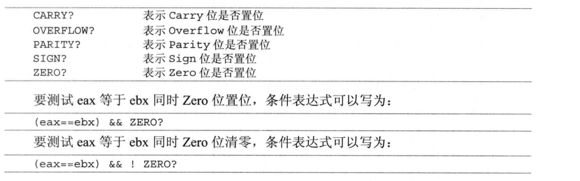

## 第三章 使用MASM
### 1.Win32汇编源程序的结构
####  1.1 模式定义
####  1.2 段的定义
####  1.3 程序结束和程序入口
####  1.4 注释和换行
### 2.调用API
####  2.1 API是什么
         Win32的系统功能模块放在Windows 的动态链接库（DLL）中。
         DLL是一种Windows 的可执行文件，采用和.exe 同样的PE格式。
         在PE格式文件头的导出表中，以字符串形式指出这个DLL能提供的函数列表。应用程序使用字符串类型的函数名指定要调用的函数。
         应用程序在使用的时候由Windows 自动装入DLL程序并调用相应的函数
      
   > Win32 的基础就是由DLL组成,Win32 API 的核心由3个DLL提供
         
         1）KERNEL32.DLL：系统服务功能。包括内存管理、任务管理和动态链接等。
         2）GDI32.DLL：图形设备接口。利用VGA与DRV之类的显示设备驱动程序完成显示文本和矩形等功能。
         3）USER32.DLL：用户接口服务。建立窗口和传送消息等。
####  2.2 调用API

   > Win32 API 是用堆栈来传递参数的。

      调用者把参数一个个压入栈中。DLL中的函数程序再从堆栈中取出参数处理，并在返回之前将栈中无用的参数释放。

   > int MessageBox(HWND hWnd,LPCTSTR lpText,LPCTSTR lpCaption,UINT uType)调用实例

   ```
      push  uType
      push  lpCaption
      push  lpText
      push  hWnd
      call  Messagebox
   ```

      上述代码，在源程序编译链接成可执行文件后，call MessageBox 语句中的MessageBox 会被换成一个地址，指向可执行文件中的导入表。导入表中指向MessageBox函数的实际地址会在程序装入内存的时候，根据User32.dll 在内存中的位置由Windows系统动态填入。

   > invoke 语句

      invoke   函数名[,参数1][,参数2]......

   > API 函数的返回值

      返回值永远放在eax中，如果eax放不下，则eax返回一个指向返回数据的指针。
      或者调用函数时提供缓冲区地址，数据返回到缓冲区中。

   > 函数的声明

      声明函数的格式 ： 函数名 proto [距离][语言][参数1]:数据类型,[参数1]:数据类型,...
      proto 函数声明伪指令。
      距离：NEAR，FAR，NEAR16，NEAR32，FAR16，FAR32.通常可忽略。
      语言类型：同.model 的语言类型，如果忽略，使用.model定义的默认值
      参数名称仅为可读性提供，并无意义。
      win32 API 仅仅使用dword 类型的参数，所以大多数数据类型都是dword

      win32中处理字符串的API 有两类，对应两个字符集：ANSI字符集，Unicode 字符集
      ANSI 函数以A结尾
      Unicode 函数以W结尾

   > include 语句

      格式 ：include 文件名 或  include <文件名>
      所有要用到的API函数都需要在程序开始部分预先声明。
      为了简化操作，所有的声明都预先放在了一个文件中。用include 语句包含进来。
      当文件名可能产生同名或混淆时，用<> 。

   > includelib 语句

      格式： includelib 库文件名 或 includelib <库文件名>
      用法同include
   
####  2.3 API参数中的等值定义
### 3.标号、变量和数据结构
   > 标号和变量的命名规范
   -  可以用字母、数字、下划线及符号@、$和？
   -  第一个符号不能是数字
   -  长度不能超过240个字符
   -  不能使用指令名等关键字
   -  在作用域内必须唯一
####  3.1 标号
   > 定义
      
      格式：
      标号名:    目的指令    ;方法1
      标号名::    目的指令    ;方法2
      方法1的作用域是当前子程序，单个子程序标号不能重复
      方法2 用来跳转到另一个子程序中。作用域是整个程序。对其他子程序可见。

   > MASM中的@@

      当用@@做标号时，可以使用@F 和@B来引用它。
      @F：本条指令后的第一个@@标号
      @B：本条指令前的第一个@@标号
      注：程序中可以有多个@@标号，但@B和@F只去匹配最近的一个
####  3.2 全局变量
   > 定义

      格式：变量名      类型     初始值1，初始值2，...
      作用域是整个程序。
      定义在 .data / .data? 中
   
   > 全局变量的初始化值

      初始化值为0
####  3.3 局部变量
   > 局部变量的定义

      格式：local    变量名1[[重复数量]][:类型]，变量名1[[重复数量]][:类型],...
      local伪指令必须紧接在子程序定义的伪指令 proc 后，其他指令前。
      局部变量不能和全局变量同名，作用域为当前子程序。
      例: local      loc1[1024]:byte
          local      loc2
          local      loc3:WNDCLASS
      不定义数据类型，则默认为dword类型

   > 局部变量的初始化值

      局部变量无法在定义的时候指定初始化值的。
      它开始的值是其他程序执行后在堆栈中留下的垃圾。
      所以，局部变量的值一定要初始化，特别是定义结构后当参数传递给API的时候
####  3.4 数据结构
   > 具体用法，如下图所示

   )
####  3.5 变量的使用
   > movzx 和 dword ptr 指令

      mov eax,dword ptr word_address 这里不会进行汇编的语法检查，因此会得到意料之外的结果
      如果想要 余下的高位 自动补0，可以使用 movzx指令
      movzx 操作数A,操作数B
      操作数A的空间 必须大于等于操作数B的空间
      将操作数B扩展到同A一样大的空间，自动填充其他缺省位为0

   > sizeof 和 lengthof

      sizeof : 取得变量、数据类型或数据结构以字节为单位的长度
      lengthof：取得变量中数据的项数

   > 取变量地址
   -  offset 方法
   - lea 指令
   - addr 伪指令
         
         取局部变量地址时，只能用于invoke参数
         当addr 后面跟局部变量名时，编译器自动用lea指令把地址取到eax，然后用eax来代替变量地址
         因此，当invoke 传参数时，eax寄存器不能用于 addr 前面

### 4.使用子程序
####  4.1 子程序的定义
      格式：
      proc [距离][语言类型][可视区域][USES寄存器列表][,参数：类型]...[VARARG] 
      local  局部变量列表

         指令
      子程序名    endp

      子程序属性：
      距离：可以忽略
      语言类型：表示参数的使用方式和堆栈平衡的方式，有StdCall,C,SysCall,BASIC,FORTRAN,PASCAL 如果忽略，则使用程序头部.model定义
      可视区域：PIRVATE、PUBLIC、EXPORT。private只对本模块可见；public对所有模块可见（在最后的.exe文件中）;export 导出的函数，编写DLL时，导出某个函数可以这么用。默认PUBLIC
      USES寄存器列表：编译器在子程序指令开始前自动安排push 这些寄存器的指令，并在ret前自动pop，用于保存执行环境。
      参数和类型：参数指参数的名称。参数类型可以省略。默认dword。参数定义的最后如果跟VARARG 表示在已确定的参数后还可以跟多个数量不确定的参数。
####  4.2 参数传递和堆栈平衡
   
### 5.高级语法
####  5.1条件测试语句
   > 格式

      寄存器或变量   操作符   操作数
      两个或两个以上可以用逻辑运算符 连接
   
   > 标志寄存器

   
####  5.2 分支语句
   
####  5.3 循环语句
   

   > .repeat/.untilcxz 指令会使编译器强制使用loop来完成循环
### 6.代码风格
####  6.1 变量和函数的命名
   > 常用前缀

   
####  6.2 代码的书写格式
####  6.3 代码的组织